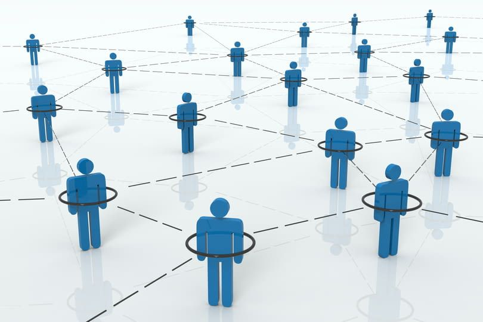

CPSC 3410 Computer Networks
===========================

About Me
--------

- Professor Craton
- Father of 2 kids (Josiah and Benji)
- My wife's name is Karin

Family
------

---

Anything you want to know about me?

Introductions
-------------

- Name
- Favorite toy as a child
- What experience do you have with computer networks?

Quizzes
-------

- Given regularly at beginning and end of class
- 2 minute time limit
- Should be relatively easy for you
- Allow me to confirm that everyone is keeping up with course material

Syllabus
--------

[Link](../syllabus.html)

Course direction
----------------

- Low-level (RF, wires, etc)
- High-level (HTTPS, JSON, etc)

Presentations
-------------

- You will complete two
- The first will cover a low-level topic
- The second will cover a high-level topic
- Presentations will take place at the beginning of class on assigned days

What is a network?
------------------

(generally, not specific to computers)

A Network
---------

- A graph
- Nodes represent elements of the network
- Edges represent connections between them

Examples of networks
--------------------

---

{height=540px}

---

---

---

Why would we want a network of computers?
-----------------------------------------

Homework
--------

- Begin reading chapter 1
- Work on lab 0
