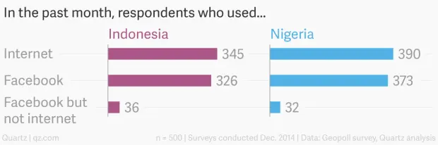
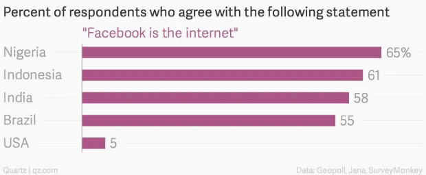

Presentations
=============

Course direction
----------------

- Low-level (RF, wires, etc)
- High-level (HTTPS, JSON, etc)

Presentations
-------------

- You will complete two
- The first will cover a low-level topic
- The second will cover a high-level topic
- Presentations will take place at the beginning of class on assigned days

Example Presentation
====================

What is the largest computer network?
-------------------------------------

-----

Deep Space Network
------------------

Functions
---------

- Telemetry
- Command
- Tracking
- Radio science
- Radar mapping

Complexes
---------

> Each of the three Deep Space Network, or DSN, sites has multiple large antennas and is designed to enable continuous radio communication between several spacecraft and Earth. 

Complexes
---------

> All three complexes consist of at least four antenna stations, each equipped with large, parabolic dish antennas and ultra-sensitive receiving systems capable of detecting incredibly faint radio signals from distant spacecraft.

---

Locations
---------

- Australia (near Canberra)
- Spain (near Madrid)
- United States (California)

Antennas
--------

- Each complex has a 70-meter antenna and several smaller antennas
- The large antenna weighs 2,970 tons.

Stuff in Space
--------------

[link](http://stuffin.space/)

Status
------

[link](https://eyes.nasa.gov/dsn/dsn.html)

Questions?
----------

References
----------

- https://deepspace.jpl.nasa.gov/about/functions/
- https://deepspace.jpl.nasa.gov/about/complexes/
- https://deepspace.jpl.nasa.gov/about/complexes/70-meter/

1.1 Applications
================

Size of the Internet
--------------------

- 20 billion+ devices

---

](media/connected-devices.png)

Devices in the home
===================

Entertainment
-------------

- Game consoles
- Smart TVs
- Media centers
- Phones

IoT (ubiquitous computing)
--------------------------

- Smart plugs
- Light bulbs
- Alexa
- Nest

Business Applications
=====================

Resource Sharing
----------------

---

---

Communications
--------------

- Email
- VoIP

---

e-commerce
----------

- Amazon
- eBay

Home Applications
=================

Computer use prior to the Internet
----------------------------------

- Word processing
- Games

Internet
--------

- News
- Communication
- Social Media
- Wikipedia

Mobile Devices
==============

Popularity
----------

More popular than desktop in terms of usage and number of devices

---

                  Desktop  Mobile/Tablet
-------           -------  -------------
Vists             29%      71%
Bounce Rate       42%      52%
Time on Site      5:52     2:40   

[source](https://www.perficient.com/insights/research-hub/mobile-vs-desktop-usage)

Location-aware apps
-------------------

- Maps
- Pokemon Go
- YikYak (RIP)

Social Issues
=============

Net Neutrality
--------------

Facebook Zero
-------------

- Offer users access to Facebook without being charged for data

---

---

DMCA
----

- Provides stronger copyright protections on the Internet
- Criminalizes circumventing copy protection (DRM)

Online Privacy
--------------

- Ad tracking
- Cookies
- Filter bubbles
- Cambridge Analytica

Location Privacy
----------------

Mobile service providers know where you are

Classes of Applications
=======================

Classes of Applications
-----------------------

- Request-based (WWW)
- Streaming
- Real-time

Request-based applications
--------------------------

- Web browsing
- Delay is acceptable

Streaming
---------

- Netflix, Twitch, etc
- Initial delay is acceptable
- Interuption is painful

Real-time
---------

- Phone, Zoom, FaceTime, etc
- Any delay or interuption is painful
