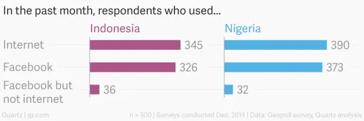
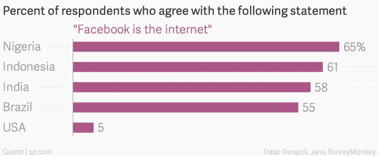

Lab questions?

1.1 Applications
================

Size of the Internet
--------------------

- 20 billion+ devices

---

](media/connected-devices.png)

Devices in the home
===================

Entertainment
-------------

- Game consoles
- Smart TVs
- Media centers
- Phones

IoT (ubiquitous computing)
--------------------------

- Smart plugs
- Light bulbs
- Alexa
- Nest

Business Applications
=====================

Resource Sharing
----------------

---

---

Communications
--------------

- Email
- VoIP

---

e-commerce
----------

- Amazon
- eBay

Home Applications
=================

Computer use prior to the Internet
----------------------------------

- Word processing
- Games

Internet
--------

- News
- Communication
- Social Media
- Wikipedia

Mobile Devices
==============

Popularity
----------

More popular than desktop in terms of usage and number of devices

---

                  Desktop  Mobile/Tablet
-------           -------  -------------
Visits            29%      71%
Bounce Rate       42%      52%
Time on Site      5:52     2:40   

[source](https://www.perficient.com/insights/research-hub/mobile-vs-desktop-usage)

Location-aware apps
-------------------

- Maps
- Pokemon Go
- YikYak (RIP)

Social Issues
=============

Net Neutrality
--------------

- ISPs must provide the same level of service for all traffic
- The state of net neutrality in US law is currently in flux

Facebook Zero
-------------

- Offer users access to Facebook without being charged for data

---

---

DMCA
----

- Provides stronger copyright protections on the Internet
- Criminalizes circumventing copy protection (DRM)

Open Access to Information
--------------------------

- BitTorrent
- Sci-hub
- Library Genesis
- [Whitehouse Public Access Memo](https://www.whitehouse.gov/wp-content/uploads/2022/08/08-2022-OSTP-Public-Access-Memo.pdf)

Online Privacy
--------------

- Ad tracking
- Cookies
- Filter bubbles
- Cambridge Analytica

Location Privacy
----------------

Mobile service providers know where you are

Classes of Applications
=======================

Classes of Applications
-----------------------

- Request-based
- Streaming
- Real-time

Request-based applications
--------------------------

- Web browsing
- Delay is acceptable

Streaming
---------

- Netflix, Twitch, etc
- Initial delay is acceptable
- Interruption is painful

Real-time
---------

- Phone, Zoom, FaceTime, etc
- Any delay or interruption is painful
