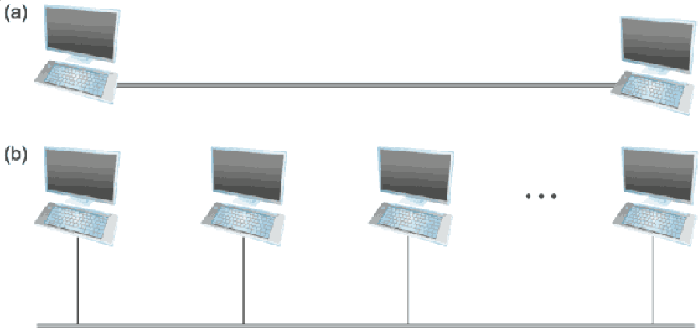
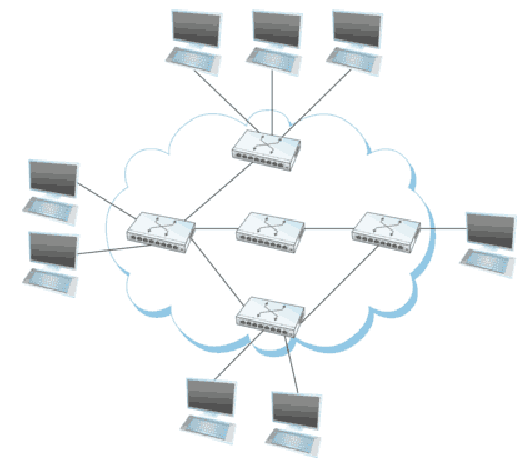

Regular Expressions
===================

Regular Expressions
-------------------

- A sequence of characters that describe a pattern in a string
- [Textbook overview](https://www.py4e.com/html3/11-regex)

Importing Modules
-----------------

- Regular expressions are a part of the Python standard library, but the module is not available to the interpreter until it is imported

```python
import re
```

RE Basics
---------

- Characters are generally matched literally.

```python
import re

s = "the quick brown fox jumped over the lazy dog"
re.findall("dog", s)
```

```python
['dog']
```

RE Methods
----------

- [re.findall](https://docs.python.org/3/library/re.html#re.findall) - Return non-overlapping matches as a list
- [re.match](https://docs.python.org/3/library/re.html#re.match) - Returns a `match` object if pattern matches string
- [re.sub](https://docs.python.org/3/library/re.html#re.sub) - Replace pattern with replacement in string
- [Many more](https://docs.python.org/3/library/re.html)

RE Boolean Or
-------------

- Pipes (|) can be used for Boolean or

```python
import re

s = "the quick brown fox jumped over the lazy dog"
re.findall("dog|fox", s)
```

```python
['fox', 'dog']
```

RE Quantifiers
--------------

- `?` - zero or one occurrences of preceding element
- `*` - zero or more occurrences of preceding element
- `+` - one or more occurrences of preceding element
- `{n}` - exactly n occurrences of preceding element

---

```python
import re

s = "the quick brown fox jumped over the lazy dog"
re.findall("ov?", s)
```

```python
['o', 'o', 'ov', 'o']
```

RE Grouping
-----------

- Parens can be used for grouping

```python
import re

s = "the quick brown fox jumped over the lazy dog"
re.findall("(d|f)o(g|x)", s)
```

```python
[('fox', 'f', 'x'), ('dog', 'd', 'g')]
```

RE Bracket Expressions
----------------------

- Brackets `[]` may be used to match a single character against a set of characters

```python
import re

s = "the quick brown fox jumped over the lazy dog"
re.findall("[df]o[gx]", s)
```

```python
['fox', 'dog']
```

RE Character Classes
--------------------

Several special character classes are provided:

- `\w` - alphanumeric characters
- `\d` - digits
- `\s` - whitespace characters
- `.` - anything

---

```python
import re

s = "the quick brown fox jumped over the lazy dog"
re.findall("\s...\s", s)
```

```python
[' fox ', ' the ']
```

1.2 Requirements
================

---

- We want to understand how to build a network from the ground up
- We must understand the design of modern networks, but it is also important to consider first principles and how we got here

Stakeholders
============

---

In considering how and why networks are the way they are, it is critical to consider the people involved with them

Users
-----

- Define the needs and use cases for the networks

Application Programmer
----------------------

- Defines specific application level network services
    - Guaranteed delivery
    - Continuous connectivity and roaming
    - Speed requirements

Network Operator
----------------

- Defines characteristics of overall system to make it manageable
    - Handling hardware failure
    - Configuration management
    - Usage restrictions, monitoring, and accounting

Network Designer
----------------

- Defines properties for a cost-effective design
    - Fairness of usage
    - Performance
    - Price
    - Physical media

Scalable Connectivity
======================

---

- A network must provide connectivity among computers
- Sometimes it is useful to have limited networks (corporate networks, campus networks, etc)
- Usually though, we want to *scale* to an arbitrary size

Hierarchy
---------

- We have to approach connectivity from multiple levels

Links
-----

- Physical connections (wires, rf) between devices create a *link* between *nodes*
- Links may be point-to-point or multiple-access
- Often seen as the *last mile* connections (Wifi, Cable, DSL, FTTH, etc)

---



Scaling Links
-------------

- A single physical connection is very limiting in terms of geographic area and number of hosts it can serve
- Fully connected networks require too many connections in most applications
- Connected hosts can cooperate to form larger networks of indirect connectivity

Switched Network
----------------

- Group of nodes that connect to forward data
- May be *packet switched* or *circuit switched*

---



Store-and-forward
-----------------

- Common packet switched network implementation
- Nodes receive a full packet of data, then forward it to the appropriate next hop on the network

Internetworking
---------------

- We frequently connect separate networks together (such as the AU campus network and your home network)
- This is known as internetworking
- Routers or gateways handle passing packets between the networks

Addressing
----------

- We have shown that we can build up a large network using interconnected nodes
- Hosts on the network still need to be able to refer to one another
- The system by which hosts refer to one another is known as *addressing*

Addresses
---------

- Typically represented as a unique byte string
- Messages typically include source and destination addresses
- *Routing* allows messages to be forwarded to the correct host

Multiple destinations
---------------------

- We may want (or need) to send data to multiple hosts
- Unicast - send to one host
- Multicast - send to a group of hosts
- Broadcast - send to all hosts

Big idea
--------

- Networks are defined recursively
- This hides complexity, overcomes physical limitations, and makes the overall system manageable

Cost-effective resource sharing
===============================

---

- Focusing on a packet switched networks, we can see that resources (such core links) are constantly being shared
- How do we ensure that shared resources are used fairly?

---


---

{height=262px}

Frequency division multiplexing
-------------------------------

- Breaks link into subchannels and uses one for each device
- You're familiar with this in TV and radio
- Wifi channels are also an example

Weaknesses
----------

- Both FDM and STDM waste available resources
- Bandwidth is reserved for all hosts, even when they don't need it
- Number of flows must be known in advance

Statistical multiplexing
------------------------

- Link is shared over time
- Data is transmitted from each flow on demand without waiting for hosts with nothing to say
- One flow may only consume the link for a given amount of time

Quality of Service (QoS)
------------------------

- Various algorithms can be chosen to determine who sends on the medium
    - First-in, first-out (FIFO)
    - Flow-based round-robin
    - Much more complex algorithms

Big idea
--------

Statistical multiplexing allows fair sharing of a link
