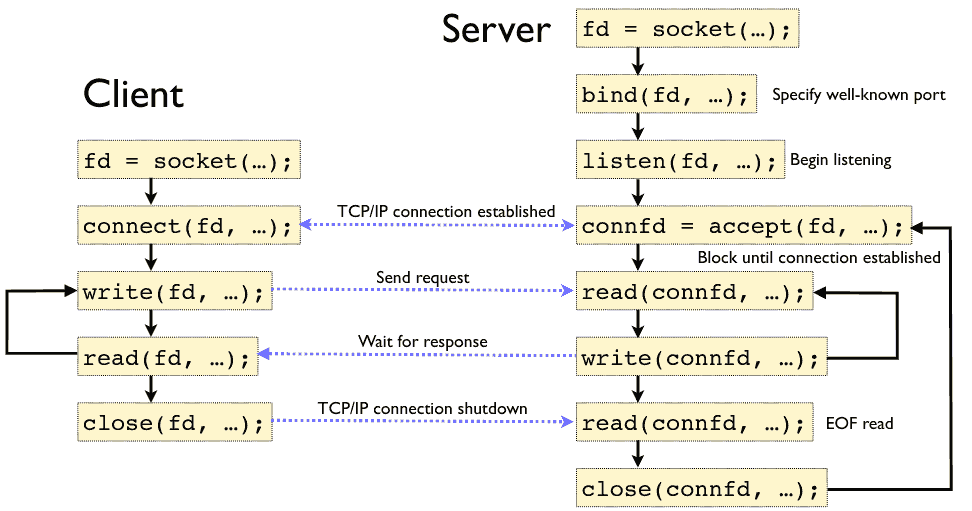

1.3 Architecture
================

---

Layering and Protocols
======================

---

What is abstraction?

---

Abstraction is the hiding of implementation details behind an interface

---

Networks have many complex details that we would like to abstract or hide.

---

Layering
--------

- We combine the network communication tasks into **Layers** with well-defined interfaces

---


---

Any given layer may have multiple implementations that implement the same basic services.

---


Protocols
---------

- The abstract objects making up the layers of the network stack
- Agreement on how communication should take place

Protocol Interfaces
-------------------

- Service interface - Provides interface for use on the local machine
- Peer interface - Determines messaging and communication with the remote host

---


Protocol Specifications
-----------------------

- Abstract documents that define how communication should work
- Created and maintained by standards bodies (IETF, ISO, etc)

---


---

How do middle layer protocols communicate with one another?

---

Indirectly, via encapsulation.

Encapsulation
-------------

- High-level messages are embedded in lower-level messages
- **Headers** are attached to the **payload** (body) adding layer-specific information

---


Layering
--------

- Headers are added as data passes down the stack of host
- Headers are removed as data is process and moves of the stack of the receiver

Key concept
-----------

Lower layers of the stack do not understand the headers from higher layers. They simply treat the information as a raw data payload.

---

Wireshark Example

Models
======

OSI Model
---------

- 7 layer model
- We don't use the OSI model in real networks, but it is useful as reference and is still widely discussed

OSI Layers
----------

- Application - High-level protocols (HTTP)
- Presentation - Data formatting (endianess, media formats, etc)
- Session - Connecting multiple channels
- Transport - Process-to-process channel
- Network - Routing among nodes in a network
- Data link - Frames
- Physical - Raw bits

Internet Architecture
---------------------

- 4 layer model
- Reflects design of modern Internet
- Descended from ARPANET architecture

---


---


Internet Architecture Concepts
------------------------------

1. Does not imply strict layering
2. Wide at the top, narrow in the middle, wide at the bottom
3. New protocols require specs and implementations

1.4 Software
============

Sockets
=======

---

Sockets provide a standard interface from the network to our applications

Socket types
------------

- Stream - provides a virtual circuit
- Datagram - delivers individual packets

Socket Implementation
---------------------

- Independent of network type
- Most typically used with TCP/IP and UDP/IP

---



Echo server example
-------------------

```python
import socket

with socket.socket(socket.AF_INET, socket.SOCK_STREAM) as s:
    s.bind(('0.0.0.0', 2001))
    s.listen()
    conn, addr = s.accept()
    with conn:
        print('Connected by', addr)
        while True:
            data = conn.recv(1024)
            if not data: break
            conn.sendall(data)
```

Echo client example
-------------------

```python
import socket

with socket.socket(socket.AF_INET, socket.SOCK_STREAM) as s:
    s.connect(('127.0.0.1', 2001))
    s.sendall(b'Hello, world')
    data = s.recv(1024)
print('Received', repr(data))
```
