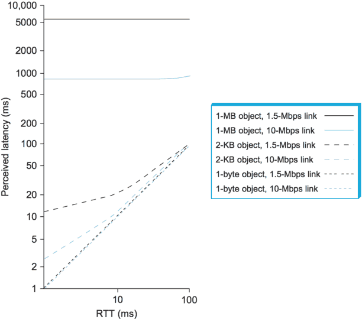

Lab questions?

1.5 Performance
===============

Bandwidth and Latency
=====================

Two measures of performance
---------------------------

- Bandwidth (throughput) - Number of bits per time
- Latency (delay) - Time needed to send

Bandwidth
---------

- Refers to two separate concepts both related to computer networks
- Digital bandwidth (MB/s)
- Analog bandwidth (MHz)

---

Latency
-------

Time it takes for data to arrive

Latency Components
------------------

- Propogation time (Distance / speed of light)
- Transmit time (Size / Bandwidth)
- Queueing delay (related to congestion)

Performance
-----------

- Bandwidth and latency combined tell us a lot about the performance of a channel
- Bandwidth and latency are distinct but often related

---

Bandwidth Delay Product
=======================

---

Why calculate bandwidth delay product?
--------------------------------------

- Amount of data sent before any arrives
- Related to window size in transmission protocols

---

Link Type             Bandwidth  One-Way Distance  RTT     RTT x Bandwidth
---------             ---------  ----------------  ---     ---------------
Wireless LAN          54 Mbps    50 m              0.33 μs 18 bits
Satellite             1 Gbps     35,000 km         230 ms  230 Mb
Cross-country fiber   10 Gbps    4,000 km          40 ms   400 Mb

High-speed networks
===================

---

- Network bandwidth continues to increase
- Network latency is bounded by physics

---

---

As networks become faster, latency become the limiting factor for performance.

---

Any degradation that requires additional round trips will significantly hurt total real bandwidth

Application Performance
=======================

---

Applications may have specific performance requirements

Known application requirements
------------------------------

- Fixed bandwidth (VOIP, video chats, gaming, etc)
- Minimum latency requirements
- Jitter requirements

Jitter
------

- Change in latency from one time to another
- Can cause buffer underflow
- Can cause gaps in voice transmissions

