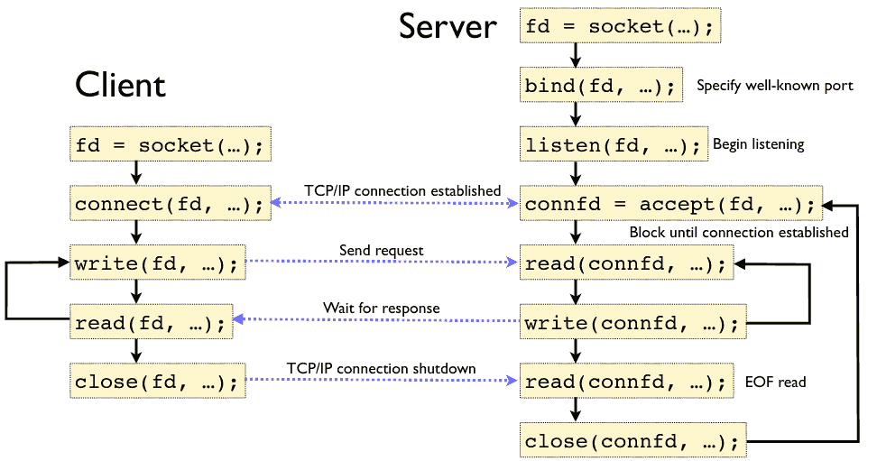

Lab questions?

Models
======

OSI Model
---------

- 7 layer model
- We don't use the OSI model in real networks, but it is useful as reference and is still widely discussed

OSI Layers
----------

- Application - High-level protocols (HTTP)
- Presentation - Data formatting (endianess, media formats, etc)
- Session - Connecting multiple channels
- Transport - Process-to-process channel
- Network - Routing among nodes in a network
- Data link - Frames
- Physical - Raw bits

Internet Architecture
---------------------

- 4 layer model
- Reflects design of modern Internet
- Descended from ARPANET architecture
- TCP/IP model

---


---


Internet Architecture Concepts
------------------------------

1. Does not imply strict layering
2. Wide at the top, narrow in the middle, wide at the bottom
3. New protocols require specs and implementations

1.4 Software
============

Sockets
=======

---

Sockets provide a standard interface from the network to our applications

Socket types
------------

- Stream - provides a virtual circuit
- Datagram - delivers individual packets

Socket Implementation
---------------------

- Independent of network type
- Most typically used with TCP/IP and UDP/IP

---



Echo server example
-------------------

```python
import socket

with socket.socket(socket.AF_INET, socket.SOCK_STREAM) as s:
    s.bind(('0.0.0.0', 2001))
    s.listen()
    conn, addr = s.accept()
    with conn:
        print('Connected by', addr)
        while True:
            data = conn.recv(1024)
            if not data: break
            conn.sendall(data)
```

Echo client example
-------------------

```python
import socket

with socket.socket(socket.AF_INET, socket.SOCK_STREAM) as s:
    s.connect(('127.0.0.1', 2001))
    s.sendall(b'Hello, world')
    data = s.recv(1024)
print('Received', repr(data))
```
