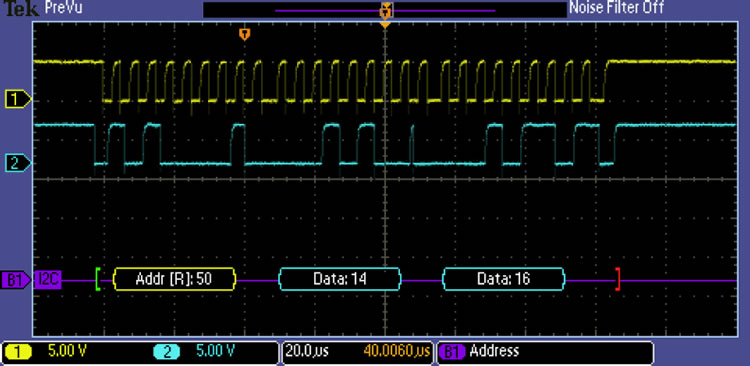

1.5 Performance
===============

Bandwidth and Latency
=====================

Two measures of performance
---------------------------

- Bandwidth (throughput) - Number of bits per time
- Latency (delay) - Time needed to send

Bandwidth
---------

- Refers to two separate concepts both related to computer networks
- Digital bandwidth (MB/s)
- Analog bandwidth (MHz)

---

Latency
-------

Time it takes for data to arrive

Latency Components
------------------

- Propogation time (Distance / speed of light)
- Transmit time (Size / Bandwidth)
- Queueing delay (related to congestion)

Performance
-----------

- Bandwidth and latency combined tell us a lot about the performance of a channel
- Bandwidth and latency are distinct but often related

---

Bandwidth Delay Product
=======================

---

Why calculate bandwidth delay product?
--------------------------------------

- Amount of data sent before any arrives
- Related to window size in transmission protocols

---

Link Type             Bandwidth  One-Way Distance  RTT     RTT x Bandwidth
---------             ---------  ----------------  ---     ---------------
Wireless LAN          54 Mbps    50 m              0.33 μs 18 bits
Satellite             1 Gbps     35,000 km         230 ms  230 Mb
Cross-country fiber   10 Gbps    4,000 km          40 ms   400 Mb

High-speed networks
===================

---

- Network bandwidth continues to increase
- Network latency is bounded by physics

---

---

As networks become faster, latency become the limiting factor for performance.

---

Any degradation that requires additional round trips will significantly hurt total real bandwidth

Application Performance
=======================

---

Applications may have specific performance requirements

Known application requirements
------------------------------

- Fixed bandwidth (VOIP, video chats, gaming, etc)
- Minimum latency requirements
- Jitter requirements

Jitter
------

- Change in latency from one time to another
- Can cause buffer underflow
- Can cause gaps in voice transmissions

2.1 Technology Landscape
========================

Connecting to a Network
=======================

---

- There exist basic problems in connecting to any network
- Medium (wire, optical, RF, etc)

Specific Issues
---------------

- Encoding - how bits represented
- Framing - how we begin and end
- Error detection - how we know it worked
- Reliability - how we fix errors
- Media Access control - how we decide who can talk

---

Link Types
----------

- FTTH - PON
- Mobile - 4G, 5G
- Laptops - Wifi
- Desktops - Wired Ethernet
- Servers - Wired Ethernet, Fiber

Abstraction
-----------

We want to hide the differences between links and deliver a simple bitstream interface

Link Characteristics
--------------------

- Material - Copper, optical, RF, etc
- Frequency (analog bandwidth)

---

---

Physical links are fundamentally analog

Digital to Analog
-----------------

- Modulation - Representing 1s and 0s "on the wire"
- Encoding - Converting binary data to 1s and 0s to put on the wire

Fourier Series
--------------

- Any repeating signal can be represented by the sum of sines and cosines

---

---

Why should we care?

---

Instantaneous change requires infinite frequency to perfectly represent. 

Physical channels have limited analog frequency bandwidth, so they cannot perfectly represent digital signals.

---

Nyquist and Shannon
-------------------

- Proved several theorems ragarding the maximum digital bandwidth of a channel

Nyquist
-------

$\textrm{maximum data rate} = 2B \times log_2{V} bits/sec$

- B is analog bandwidth
- V is the number of discrete signal levels

Shannon
-------

Real channels have noise

$\textrm{maximum data rate} = B \times log_2{1 + {S \over N}} bits/sec$

- S is signal
- N is is noise
- This term can be referred to as signal to noise ratio (SNR)

Key concept
-----------

There are physical limits to how much data can be sent down a given physical medium

Modulation
----------

- Amplitude
- Frequency
- Phase
- QAM

---

