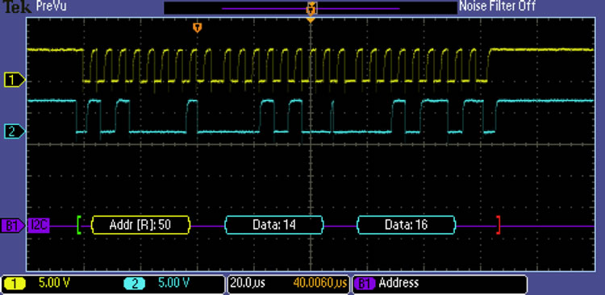

2.1 Technology Landscape
========================

Connecting to a Network
=======================

---

- There exist basic problems in connecting to any network
- Medium (wire, optical, RF, etc)

Specific Issues
---------------

- Encoding - how bits represented
- Framing - how we begin and end
- Error detection - how we know it worked
- Reliability - how we fix errors
- Media Access control - how we decide who can talk

---

Link Types
----------

- FTTH - PON
- Mobile - 4G, 5G
- Laptops - Wifi
- Desktops - Wired Ethernet
- Servers - Wired Ethernet, Fiber

Abstraction
-----------

We want to hide the differences between links and deliver a simple bitstream interface

Link Characteristics
--------------------

- Material - Copper, optical, RF, etc
- Frequency (analog bandwidth)

---

---

Physical links are fundamentally analog

Digital to Analog
-----------------

- Modulation - Representing 1s and 0s "on the wire"
- Encoding - Converting binary data to 1s and 0s to put on the wire

Fourier Series
--------------

- Any repeating signal can be represented by the sum of sines and cosines

---

---

Why should we care?

---

Instantaneous change requires infinite frequency to perfectly represent. 

Physical channels have limited analog frequency bandwidth, so they cannot perfectly represent digital signals.

---

Nyquist and Shannon
-------------------

- Proved several theorems ragarding the maximum digital bandwidth of a channel

Nyquist
-------

$\textrm{maximum data rate} = 2B \times log_2{V} bits/sec$

- B is analog bandwidth
- V is the number of discrete signal levels

Shannon
-------

Real channels have noise

$\textrm{maximum data rate} = B \times log_2{1 + {S \over N}} bits/sec$

- S is signal
- N is is noise
- This term can be referred to as signal to noise ratio (SNR)

Key concept
-----------

There are physical limits to how much data can be sent down a given physical medium

Modulation
----------

- Amplitude
- Frequency
- Phase
- QAM

---

2.2 Encoding
============

---

How do we correctly communicate a stream of bits down a medium that we can turn on and off?

---

Network adapter
---------------

- Performs bitstream encoding
- We'll assume that *modulation* has been handled, and we have a medium that we can make either high or low

Examples
--------

- Light in a fiber cable (ASK)
- Voltage on a serial cable (high or low)
- ASK for a Wifi signal

---

Non-return to zero (NRZ) encoding
---------------------------------

- High maps to 1
- Low maps to 0

---

Problems with NRZ
-----------------

Long strings of 1s or 0s in data cause problems with

- Baseline wander
- Clock recovery

Baseline Wander
---------------

- Reciever stores a moving average of the signal level
- A steady state causes the average to move to high
- This can lead to value being misread

Clock
-----

- Determines when to read the medium to determine the current bit value

Clock Recovery
--------------

- Clocks at senders and recievers are not perfectly synced
- We resync clocks at state transitions
- Too few state transitions can lead to clocks drifting apart

---

Fireflies
---------

- Can flash at night
- Some species can syncronize their flashes

---

[Interactive Fireflies](https://ncase.me/fireflies/)

Non-return to zero inverted (NRZI)
----------------------------------

- State change represents a 1
- Steady state represents a 0
- Solves issue with repeated 1s
- Doesn't help with repeated 0s

Manchester Encoding
-------------------

- XOR an explicit clock signal with the data signal
- We always have state transitions
- Requires 2x data rate
- Used by Fast Ethernet

---

4B/5B
-----

- Encode all 4 bit sequences as 5 bit sequences with state transitions
- e.g. 0000 becomes 11110
- Ensure state transition with less overhead than Manchester encoding
- USB uses variants of this (10b/12b, 128b/132b)

Baud rate vs bit rate
---------------------

- Baud rate - symbols per time
- Bit rate - bits per time
- These can be the same if we transmit 1 bit per symbol
