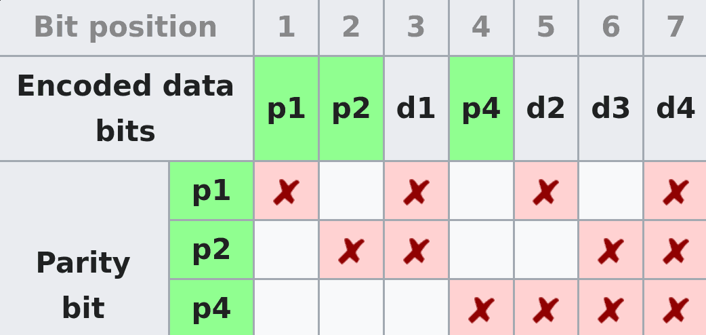

2.4 Error Detection
===================

---

---

Errors
------

- Data errors at the physical level are unavoidable
- Data errors at the software level are unacceptable

Link Types
----------

- Fiber - very low error rate on good links
- Copper - very low error rate, but somewhat worse than fiber
- RF - bit errors and long strings of errors are probable

Handling errors
---------------

1. Detect that an error has occurred
2. Ask for retransmission

Simple error detection
----------------------

- Send message twice
- Confirm that both copies are identical

Simple error detection
----------------------

- 2x overhead
- A 2-bit error could be undetected

Overhead
--------

- We want to be able to add k bits to an n bit message in a way that can detect the most possible errors

Parity
------

- Adds a single bit to a message that makes the total number of 1s odd or even
- Will catch any odd number of bit error (1, 3, etc)
- Will miss any even number of bit errors
- Used in RS232

Checksum
--------

- Error detecting code involving addition

Checksum Process
----------------

- Treat each word in the message as a number
- Add the words and transmit their lowest k-bits as the checksum
- Confirm that the checksum matches when receiving frames
- Catches most errors, but will still miss errors that "cancel out"

Cyclic Redundancy Check (CRC)
-----------------------------

- Provides a division-like check function
- Efficient to implement in hardware
- Can be tuned by selecting different polynomials
- CRC32 is used in Ethernet

---

---

[CRC Details Video](https://www.youtube.com/watch?v=izG7qT0EpBw)

CRC as a hash function
----------------------

- CRC is effectively a hash function
- It's not designed as a *cryptographic* hash function
- It's not  designed to prevent intentional collisions, but simply to detect random errors
- Do not use it as a cryptographic hash function

Error Correction
================

Hamming Codes
-------------

- A mechanism to correct errors in transmission using overlapping parity bits
- Provides relatively simple ECC example
- Used in ECC RAM

---

Hamming Example
---------------

2.5 Reliable Transmission
=========================

Errors
------

- Bitstreams may have errors
- Errors can be detected using CRCs or other mechanisms
- Errors are relatively expensive to repair

Layer
-----

- Reliable transmission may be provided by the link layer
- It may also be provided by higher layers
- The basic techniques are the same

Automatic Repeat Request (ARQ)
------------------------------

- Receiver - Acknowledge when data arrives
- Sender - Timeout if no acknowledgment
- Retransmission can be used to provide correct data

Stop and wait
=============

---

- After sending a frame, we wait for acknowledgment before sending another
- Retry sending after a timeout and no acknowledgment

---

This seems simple. What can go wrong?

---

{height=540px}

Duplicate frames
----------------

- If we acknowledge a frame, but the ack doesn't arrive in time, the frame will be retransmitted
- This will appear to be a *new* frame, causing data duplication
- We can solve this using 1-bit sequence number

---

{height=540px}

Stop and wait limitation
------------------------

Our max data rate will be capped by our frame size and RTT

Key idea
--------

Our delay bandwidth product represents the amount of data we need to be able to send without acknowledgment to optimize throughput

