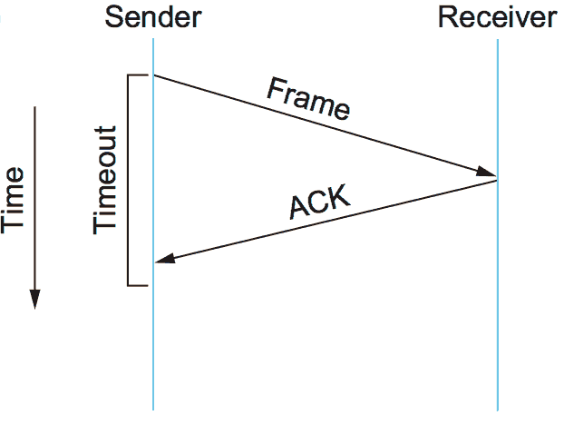
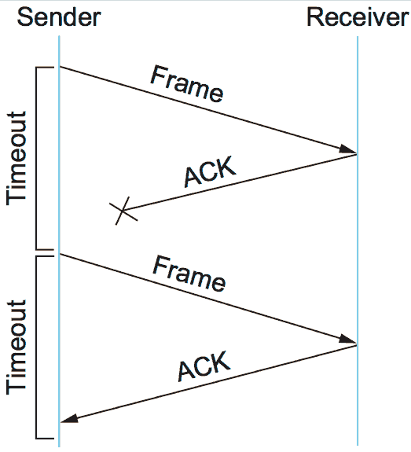
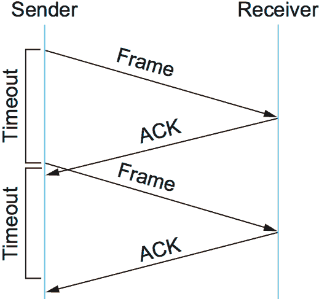

Lab questions?
--------------

2.5 Reliable Transmission
=========================

Layer
-----

- Reliable transmission may be provided by the link layer
- It may also be provided by higher layers
- The basic techniques are the same

Errors
------

- Bitstreams may have errors
- Errors can be detected using CRCs or other mechanisms
- Some errors can be corrected by including redundant data, but this has fixed cost

NACK
----

- Receiver - Send message to sender letting them know data is corrupted
- Sender - Resend the message

NACK Weaknesses
---------------

- Doesn't positively confirm that all data was received
- In the case of certain errors, the receiver may not even know they were meant to get a message

Automatic Repeat Request (ARQ)
------------------------------

- Receiver - Acknowledge when data arrives
- Sender - Timeout if no acknowledgment
- Retransmission can be used to provide correct data

---

---

Stop and wait
=============

---

- After sending a frame, we wait for acknowledgment before sending another
- Retry sending after a timeout and no acknowledgment

---

This seems simple. What can go wrong?

---

---

Duplicate frames
----------------

- If we acknowledge a frame, but the ACK doesn't arrive in time, the frame will be retransmitted
- This will appear to be a *new* frame, causing data duplication
- We can solve this using 1-bit sequence number

---

{height=540px}

Stop and wait limitation
------------------------

Our max data rate will be capped by our frame size and RTT

Key idea
--------

Our delay bandwidth product represents the amount of data we need to be able to send without acknowledgment to optimize throughput

Sliding Window
==============

---

- Send multiple frames at once
- Wait for acknowledgments before sending more
- Adjust window size as needed

Sender Algorithm
-----------------

- Assign unique and incrementing SeqNum value to frames
- Send window size (SWS) - limits outstanding frames
- Last acknowledgement received (LAR) - SeqNum of last ACK
- Last frame sent (LFS) - SeqNum of last sent frame
- `LFS - LAR <= SWS` must always be true

---

Sender Algorithm
----------------

- When ACK arrives LAR is incremented appropriately and a frame is sent
- Timeouts are used to retransmit frames that aren't acknowledged
- The senders must buffer SWS previous frames

Receiver Algorithm
------------------

- Receive window size (RWS) - upper bound of out-of-order frames to accept
- Largest acceptable frame (LAF) - SeqNum of the highest frame we would accept
- Last frame received (LFR) - SeqNum of the last frame received
- LAF - LFR <= RWS will always be true

---

Receiver algorithm
------------------

- If LFR < SeqNum <= LAF an incoming frame can be accepted. Otherwise, it is dropped
- Send an ACK for the highest SeqNum for which all lower frames have been correctly received

Out of order packets
--------------------

- No ACK for packets that come early, but buffer them
- Cumulative ACK when appropriate
- We could send a negative acknowledgement when we miss a packet, but we typically don't as it adds additional overhead

Out of order packets
--------------------

- These are impossible on most point-to-point links (aside from retransmission due to errors)
- They become possible as systems get more complex and packets can take multiple routes to a destination

Selective Acknowledgement
-------------------------

- Acknowledge every frame, as opposed to cumulative acknowledge where we batch acknowledgement for previous frames
- Adds complexity
- Increases traffic
- May improve overall throughput, as retransmission can happen faster

Window size
-----------

- Ideal sender window is related to bandwidth delay product
- Receiver window can be 1 to not require buffer and drop out of order packets
- SWS can be equal to RWS to appropriately buffer any packets that are usable

Sequence number overflow
------------------------

- On real networks, the sequence number is finite
- This means overflow is possible
- [Overflow example](https://replit.com/@jncraton/int-overflow)

Sequence number considerations
------------------------------

- Smaller sizes reduce overhead, but require reuse to happen sooner
- The max safe SWS is related to MaxSeqNum on a point-to-point link
- If frames can be reordered in transit, we need a more comprehensive solutions

Sliding Window Protocol Benefits
--------------------------------

1. Reliable delivery over unreliable channel
2. Reordering for out-of-order frames
3. Basic flow control
