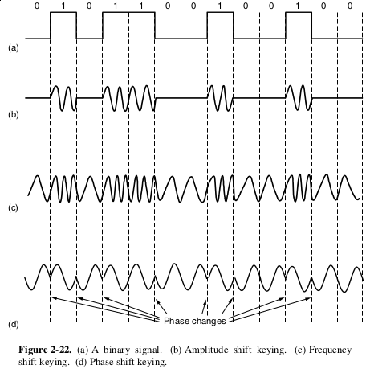

Digital Modulation and Multiplexing
===================================

Digital Modulation
------------------

The process of converting between bits and the signals that represent them

Baseband and passband transmission
----------------------------------

- Baseband uses 0 to some frequency (commonly used on wires)
- Passband uses a frequency slice (commonly used for wireless and optical)

Non-return to Zero
------------------

- Presence represents a one
- Absense indicates a zero
- Simplest modulation scheme

---

---

Bandwidth efficiency
--------------------

- Our analog bandwidth is limited
- What problems does NRZ face in optimizing efficiency?

---

Expanding our symbols
---------------------

- Transmit two bits at once
- 00 = 0V
- 01 = 1V
- 10 = 2V
- 11 = 3V

---

Symbol rate (also call baud rate) - rate at which the signal changes

---

Bit rate - Symbol rate times bits per symbol

Clock Recovery
--------------

- In order to decode a symbol, we need to know which position in the bit stream it is associated with
- We time this using a clock, but clocks aren't perfect

Sharing the clock
-----------------

- Use a separate medium (extra wire, etc)
- Encode onto exisiting signal
- Derive clock from signal

Manchester encoding
-------------------

- Simply XOR clock with data
- Used on classic Ethernet

---

NRZI
----

- A 1 is represented by a state change
- Prevents a string of 1s from causing the clock to desync
- Doesn't solve a string of zeroes

---

What about strings of zeroes?
-----------------------------

- Codewords 
- Scrambling

---

Scrambling
----------

- XOR with random data
- No bandwidth overhead
- Not guaranteed to be 100% effective
- Needs source of random data

Balanced signals
----------------

- Net zero voltage over time
- More energy efficient

Bipolar encoding or AMI
-----------------------

- Use opposite values for 0 and 1
- e.g. 0 = -1v and 1 = +1v

---

Certain encodings can be used to provide a balance of 0s and 1s (8b/10b)

Passband Transmission
---------------------

- We can't simply turn the signal on and off at some frequency
- We must encode data into a frequency range

How do we transmit data?
------------------------

- Amplitude Shift Keying (ASK)
- Frequency Shift Keying (FSK)
- Phase Shift Keying (PSK)

---

Phase Shift Keying
------------------

- Binary PSK (0 and 180 degrees)
- Quadrature PSK (45, 135, 225, 315 degrees)

Quadrature Amplitude Modulation
-------------------------------

- Combines PSK with ASK

---

Gray Code
---------

- Encoding sequential values differ by only one bit

---

Multiplexing
============

---

The costs of installing a single high-bandwidth link are ofter cheaper than installing many low-bandwidth links, so we would like to have ways to send multiple data streams over one physical link.

Frequency Division Multiplexing
-------------------------------

Break up the larger channel into smaller frequency bands that do not interfere with one another

---

Time Division Multiplexing
--------------------------

- Break up the larger channel into time slices
- Allower narrower channels to fill time slots on a schedule
- A small guard time is provided between slots to prevent interference

Code Division Multiplexing
--------------------------

- Spread narrow bands over the wider spectrum using coding techniques
