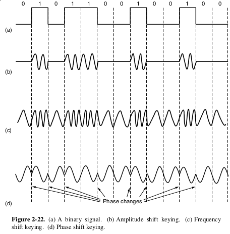
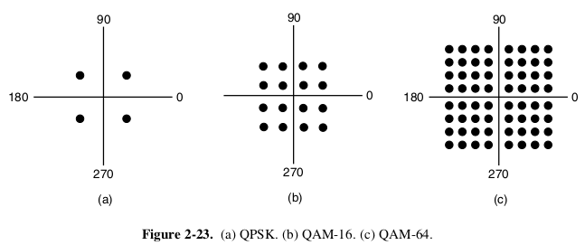
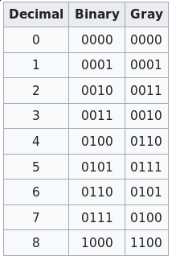
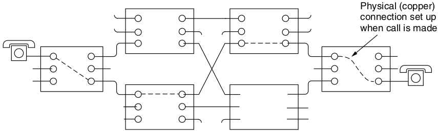
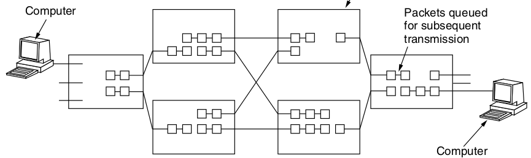

Digital Modulation
==================

Passband Transmission
---------------------

- We can't simply turn the signal on and off at some frequency
- We must encode data into a frequency range

How do we transmit data?
------------------------

- Amplitude Shift Keying (ASK)
- Frequency Shift Keying (FSK)
- Phase Shift Keying (PSK)

---

---

Phase Shift Keying
------------------

- Binary PSK (0 and 180 degrees)
- Quadrature PSK (45, 135, 225, 315 degrees)

Quadrature Amplitude Modulation (QAM)
-------------------------------------

- Combines PSK with ASK

---

Gray Code
---------

- Encoding sequential values differ by only one bit

---

Multiplexing
============

---

The costs of installing a single high-bandwidth link are ofter cheaper than installing many low-bandwidth links, so we would like to have ways to send multiple data streams over one physical link.

Frequency Division Multiplexing
-------------------------------

Break up the larger channel into smaller frequency bands that do not interfere with one another

---

Time Division Multiplexing
--------------------------

- Break up the larger channel into time slices
- Allower narrower channels to fill time slots on a schedule
- A small guard time is provided between slots to prevent interference

Code Division Multiplexing
--------------------------

- Spread narrow bands over the wider spectrum using coding techniques

Switching (2.6.5)
=================

---

---

---

Queuing Delay
-------------

- Packets fully arrive at host before being forwarded
- This introduces latency

Congestion
----------

- Felt at connection time for circuit switching (busy signal)
- Felt at transmission time for packet switching (delays, dropped packets, etc)

Mobile Phones
=============

---

Generations
-----------

1. Analog voice
2. Digital voice
3. Digital voice and data
4. Data only (VOIP)

4G LTE
------

- Simplifies system design by moving to pure packet switching and IP
- Max 300 mbps up and 75 mbps down
- Sub 5ms latency
- Supports 200 nodes per cell

Multiple-Input and Multiple-Output (MIMO)
-----------------------------------------

- Devices use multiple antennas to create separate spatial streams between devices

---

