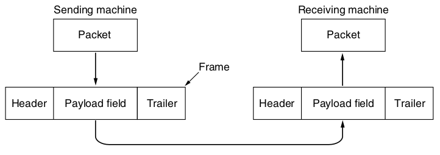

Exam Review
===========

Big picture
-----------

- 20 multiple choice questions
- 3 essay questions

Notes
-----

You may bring 1 double-sided sheet of notes with you. It may be no larger than a piece of 8.5x11 US letter paper.

Calculator
----------

There will be some math on the exam, but you will not have access to a calculator. You may use a blank piece of paper and pencil.

Math
----

Some examples of what you should be able to do unassisted:

- $\log_2(16) = 4$
- 2 GB / s = 16 Gb / s
- 120 Tb / minutes = 2 Tb / second

SI Prefixes
-----------

- Peta (P) = $10^15$ 
- Tera (T) = $10^12$
- Giga (G) = $10^9$
- Mega (M) = $10^6$
- Kilo (K) = $10^3$

What could you be asked?
------------------------

- Content from class sessions
- Content from textbook
- My intent is to not test you on anything that you wouldn't have learned from *either* the textbook or our class sessions

Multiple choice questions
-------------------------

- Focus on facts
- Give you an opportunity to demonstrate that you understand the terms and basic concepts

Essay questions
---------------

- Focus on application
- Give you an opportunity to demonstrate that you know how to critically apply concepts in new or specific contexts

Essay question content
----------------------

1. Wireless vs Wired
2. Fiber vs Copper
3. Modulation techniques use cases and advantages/weaknesses

Data Link Layer
===============

---

- Application
- Transport
- Network
- Data Link <-- We are here
- Physical

---

Interacts with the physical layers to send and receive bits

---

Functions
---------

- Providing a well-defined interface up to the network layer
- Handling certain classes of transmission errors
- Regulating the flow rate of data to prevent fast hosts from flooding slow hosts

Framing
-------

- Data is encapsulated to provide metadata related to a payload

---

---

