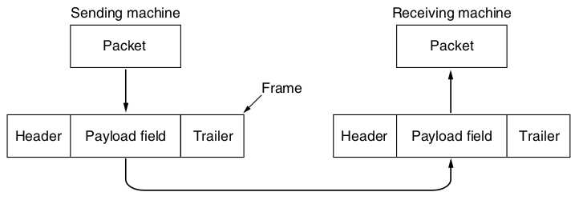

Data Link Layer
===============

---

- Application
- Transport
- Network
- Data Link <-- We are here
- Physical

---

Interacts with the physical layers to send and receive bits

---

Functions
---------

- Providing a well-defined interface up to the network layer
- Handling certain classes of transmission errors
- Regulating the flow rate of data to prevent fast hosts from flooding slow hosts

Framing
-------

- Data is encapsulated to provide metadata related to a payload

---



---


---

The physical layer provides us with a stream of bits. How do we break up the stream into frames?

---

Finding frames
--------------

- Byte count
- Flag bytes with byte stuffing
- Flag bits with bit stuffing
- Physical layer coding violations

Byte count
----------

- Store frame length in header
- Simple
- Minimal overhead (<1%) for packet lengths up to 255 bytes, we need only 1 byte to represent the length

---

What are the issues with transmitting a bytes count to determine frame boundaries?

---

Physical layer errors
---------------------

- What if something (RF interference, etc) at the physical layer causes a bit to be misread?

---

Single bit errors cause the frame position to be lost. Once lost, it can't be recovered without using other techniques.

Flag bytes
----------

- Insert special bytes at start and end of frame
- This adds additional overhead (typically 2 bytes per frame)

---

What problems do flag bytes introduce?

---

What if flag bytes appear in our data?

Escpaing (byte stuffing)
------------------------

- If flag bytes appear in our data, we prepend a special escape byte

---

What if escape bytes appear in data?

---

We also escape escape bytes.

---

Escaping in C
-------------

```c
printf("a");
printf("%d", number);
printf("%%"): // Print literal % char
```

Escaping in Python
------------------

```python
print('It\'s hot outside')
```

Bit stuffing
------------

- Some link layer protocols don't depend on byte boundaries
- We can delimit frames at the bit level as we did at the byte level
- A flag pattern is used e.g. 0b11111

---


---

Special physical layer flags
----------------------------

- We can sometimes use carefully chosen flag symbols that wouldn't otherwise appear at the physical layer
- For example, choose a symbol that can't appear in 4B/5B coding

Combined methods
----------------

- Many protocols use multiple methods

802.11
------

- Uses a long escape squence or preamble to start transmission
- Includes length at the end of the preamble

Error Detection and Correction
==============================

Error Correcting codes
----------------------

- Carry enough information to fix errors
- Usage referred to as forward error correction (FEC)

Error Detecting Codes
---------------------

Carry enough information to detect errors

---

As a general rule, the more lossy a channel is, the more we gain from investing in forward error correction.

---

Error models
------------

- Single bit
- Bursts

Erasure channel
---------------

Some physical transmission will note when a bit was unable to be read

Usage of error detection and correction
---------------------------------------

Error correction and detection can happen at many different levels of the network stack from physical up to application.

Hamming Code
------------

- Error correcting

Convolutional Code
------------------

- Error detecting