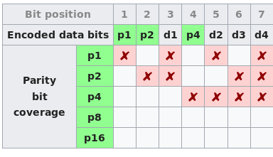
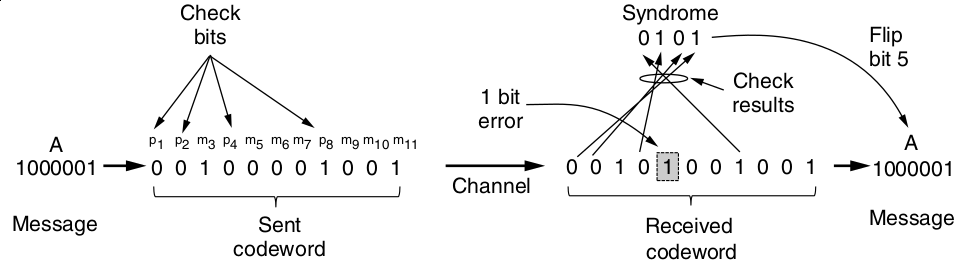

Error Correction
================

Hamming Code
------------

- Error correcting

---

Hamming 3,1
-----------

- 3 total bits
- 1 data bits
- 33% efficient

---

1. Number bits starting from one
2. Also number in binary
3. Powers of 2 are parity bits, others are data
4. nth parity bits cover positions where nth LSB is set

---

Correcting errors
-----------------

1. If a single parity bit is wrong, it is in error
2. If multiple parity bits are wrong, the sum of their positions identifies the error---

---

This is also called a repetition code

---

Hamming 7,4
-----------

- 7 total bits
- 4 data bits
- 57% efficient

---

Hamming Code
------------

- Corrects all single bit errors
- Identifies most two bit errors

Convolutional Code
------------------

- Error detecting

Reed-solomon codes
------------------

Low-density parity check codes
------------------------------

Elementary Data Link Protocols
==============================

Ideal channel
-------------

- No errors
- No processing limitations
- Channel always open

Handling limited processing
---------------------------

Stop-and-wait waits for a frame to be acknowledged before sending another.

Handling Loss
-------------

- Automatic Repeat reQuest (ARQ)
- AKA Positive Acknowledgement with Retransmission (PAR)
- Requires adding sequence numbers to header in case ACK is lost

Sliding Window Protocols
========================

Piggybacking
------------

Temporarily delay acks until we have a packet to send

