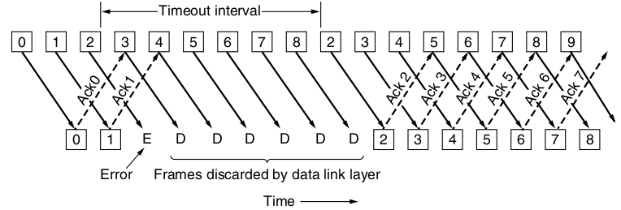
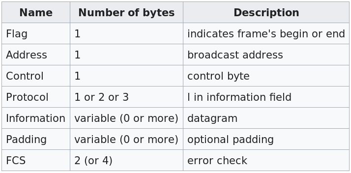

Handling Errors
---------------

---

---

Tradeoffs
---------

- Selective repeat saves bandwidth
- Go-back-n allows size 1 sliding window and simpler hardware

Cumulative Acknowledgement
--------------------------

An ACK implies ACKs for all previous data

Example Protocols
=================

PPP
---

Point-to-point Protocol

Features
--------

- Framing method delineating start and end with error detection
- Link Control Protocol (LCP) to handle bringing up links and managing parameters
- Network-layer option negotiation via NCP

Overview
--------

- Byte oriented protocol
- Byte stuffing and flag bytes used for frame detection
- Sliding window, acknowledgements, and timeouts for flow control

---------

Medium Access Control Sublayer
==============================

---

How do we decide who gets to talk on a shared broadcast medium

Static Allocation
-----------------

Each hosts get allocated a piece of the layer to use (FDM, TDM, etc)

Weaknesses
----------

- Very poor performance with bursty traffic (most traffic is bursty)

Dynamic Channel Allocation
--------------------------

Use real-time algorithms to allocate channel access

Assumptions
-----------

1. Independent Traffic
2. Single Channel
3. Observable Collisions
4. Continuous or slotted time
5. Carrier sense or no carrier sense

Independent traffic
-------------------

- The most questionable assumption
- It is usually incorrect, but makes networks much simpler to reason about

ALOHA
-----

- If you have data to send, send it
- A central hub relays your transmission to all hosts
- You listen for the retransmission to ensure that no errors occurred
- If there was an error, try again after a random delay

Slotted ALOHA
-------------