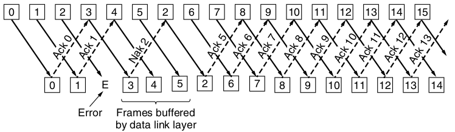

Sliding Window Protocols
========================

Handling Errors
---------------

---

---

Tradeoffs
---------

- Selective repeat saves bandwidth
- Go-back-n allows size 1 sliding window and simpler hardware

Cumulative Acknowledgement
--------------------------

An ACK implies ACKs for all previous data
