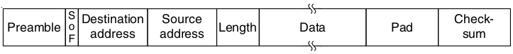

Carrier Sense Multiple Access (CSMA)
====================================

1-persistent CSMA
-----------------

1. If you have data to send, listen for traffic
2. Wait if someone else is transmitting
3. Send your data when channel is quiet

---

Does this solve our collision problem?

---

What happens when 2 hosts have data ready to send while a third host is transmitting?

Non-persistent CSMA
-------------------

Introduce a random delay if we are waiting on the line to be free

P-persistent CSMA
-----------------

- Slotted protocol
- Transmit with probability P when line is available and we have data to send

---

CSMA with Collision Detection
=============================

---

What if two hosts start transmitting at the same time?

---

Time (and therefore bandwidth) get wasted while hosts clobber one another

---

Collision Detection
-------------------

- Listen as we transmit to make sure we are only hearing what we are transmitting
- Stop transmitting if another host is also transmitting
- Used in classic Ethernet

Collision Free Protocols
========================

Token Passing
-------------

---

Stations pass around a token and are only allowed to transmit when they hold the token. The token is then passed to the next host in line.

Token Ring
----------

A token passing network designed as a physical ring

---

---

Is this the same as time division multiplexing?

Token Bus
---------

Hosts pass a token, but they can all hear one other on a physical bus

Wireless LAN Protocols
======================

---

Collision detection is difficult because we aren't the reciever

Hidden terminal problem
-----------------------

A node that we can't hear is tranmitting to our reciever

---

Exposed terminal problem
------------------------

A node that we can hear is tranmitting to someone else

---

Multiple Access with Collision Avoidance
----------------------------------------

- Transmit short frame (RTS)
- Reviever transmits short frame to connected clients letting them know the carrier is about to be busy (CTS)

Ethernet
========

Classic Ethernet
----------------

- Physical bus network
- Logical bus network

Switched Ethernet
-----------------

- Physical star network
- Logical bus network

---

---

Classic Ethernet Frame
----------------------

- Begins with 8 byte preamble of alternating 1s and 0s
- This generates a 10-MHz square wave for 6.4 microseconds
- Why?

---

- Clock syncronization
- RC oscillators

---

Ethernet Addressing
-------------------

- 6 bytes MAC addresses
- Oridinary addresses begin with 0
- Mulitcast or group addresses begin with 1
- All 1s is broadcast to everyone

Ethernet Payload
----------------

- Limited to 1500 bytes
- Must be padded to at least 46 bytes to ensure minimum total frame length of 64 bytes

Ethernet Checksum
-----------------

- CRC-32

Ethernet Collision Handling
---------------------------

- CSMA/CD with binary exponential backoff
- After collision, each station wait a for $2^i - 1$ slots before retransmitting where i is the number of collisions

Switched Ethernet
=================

