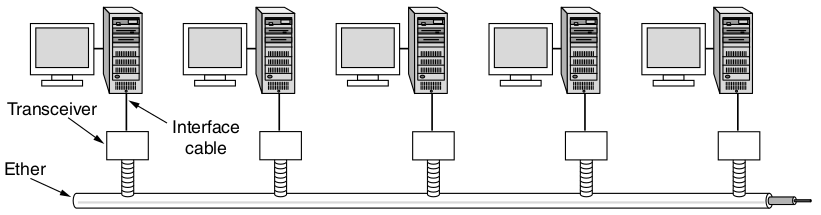
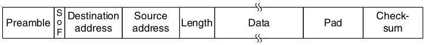

Wireless LAN Protocols
======================

---

Collision detection is difficult because we aren't the receiver

Hidden terminal problem
-----------------------

A node that we can't hear is transmitting to our receiver

---

Exposed terminal problem
------------------------

A node that we can hear is transmitting to someone else

---

Multiple Access with Collision Avoidance
----------------------------------------

- Transmit short frame (RTS)
- Receiver transmits short frame to connected clients letting them know the carrier is about to be busy (CTS)

Ethernet
========

Classic Ethernet
----------------

- Physical bus network
- Logical bus network

Switched Ethernet
-----------------

- Physical star network
- Logical bus network

---

---

Classic Ethernet Frame
----------------------

- Begins with 8 byte preamble of alternating 1s and 0s
- This generates a 10-MHz square wave for 6.4 microseconds using Manchester coding
- Why?

---

- Clock synchronization
- RC oscillators

---

Ethernet Addressing
-------------------

- 6 bytes MAC addresses
- Ordinary addresses begin with 0
- Multicast or group addresses begin with 1
- All 1s is broadcast to everyone

Ethernet Payload
----------------

- Limited to 1500 bytes
- Must be padded to at least 46 bytes to ensure minimum total frame length of 64 bytes

Ethernet Checksum
-----------------

- CRC-32

Ethernet Collision Handling
---------------------------

- CSMA/CD with binary exponential backoff
- After collision, each station waits for $2^i - 1$ slots before retransmitting where i is the number of collisions

Switched Ethernet
=================

---

---

Rationale
---------

- Wiring breaks in loops caused network fragility
- A shared bus limits all hosts to the bandwidth of single link

100Base-TX
----------

- Uses Category 5 twisted pair
- Full duplex operation
- 4B/5B at 125MHz for a data rate of...

---

100mbps

---

