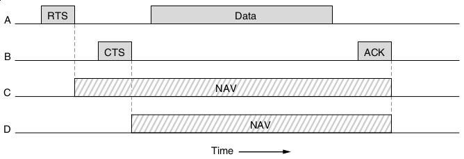
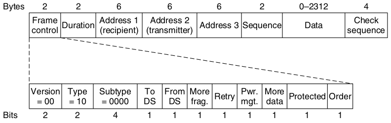

Ethernet
========

Classic Ethernet
----------------

- Physical bus network
- Logical bus network

Switched Ethernet
-----------------

- Physical star network
- Logical bus network

---

---

Classic Ethernet Frame
----------------------

- Begins with 8 byte preamble of alternating 1s and 0s
- This generates a 10-MHz square wave for 6.4 microseconds using Manchester coding
- Why?

---

- Clock synchronization
- RC oscillators

---

[Firefly Syncronization](https://ncase.me/fireflies/)

---

Ethernet Addressing
-------------------

- 6 bytes MAC addresses
- Ordinary addresses begin with 0
- Multicast or group addresses begin with 1
- All 1s is broadcast to everyone

ARP Broadcasts in Wireshark
---------------------------

Set display filter to "eth.dst == ff:ff:ff:ff:ff:ff && arp"

Ethernet Payload
----------------

- Limited to 1500 bytes
- Must be padded to at least 46 bytes to ensure minimum total frame length of 64 bytes

Ethernet Checksum
-----------------

- CRC-32

Ethernet Collision Handling
---------------------------

- CSMA/CD with binary exponential backoff
- After collision, each station waits for $2^i - 1$ slots before retransmitting where i is the number of collisions

Switched Ethernet
=================

---

---

Rationale
---------

- Wiring breaks in loops caused network fragility
- A shared bus limits all hosts to the bandwidth of single link

Advantages of switches
----------------------

- No collisions
- Multiple frames can be sent simultaneously by different hosts
- Improvement in security as not all frames are available to all hosts by default

Wireless LANs
=============

Physical Layer
--------------

- Orthogonal Frequency Division Multiplexing (OFDM) transmission for 802.11 a, g
- Multple input multiple output (MIMO) for 802.11n, ac, and ax
- Beacon frames identify access points

Collisions
----------

- Hosts track Network Allocation Vector (NAV) in each frame to know if channel is busy

---

---

