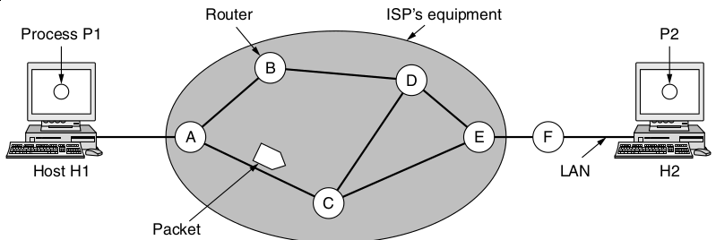
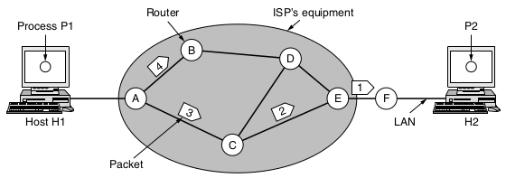
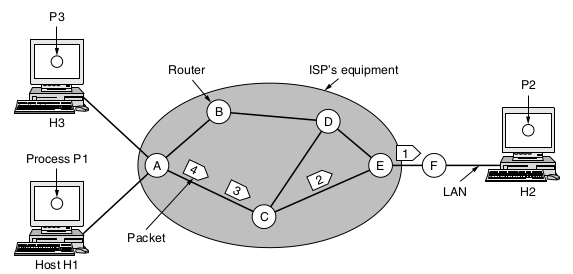
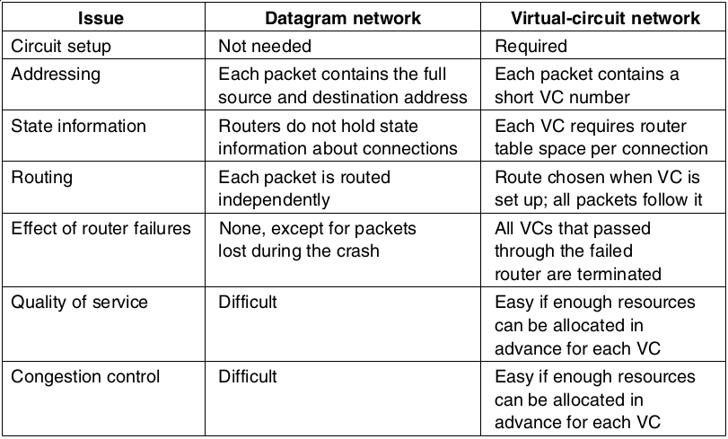

Netork Layer
============

Layers
------

- Application
- Transport
- Network <-- We are here
- Link
- Physical

---

Service Goals
-------------

- Router technology independence
- Transport layer should not need to care about router count, technology, or topology
- Network addresses should be consistent accross LANs and WANs

Connectionless Networks
-----------------------

End-to-end principle - Connections and reliable delivery are left of to the hosts at the end, and not the network hardware.

---

Connection-Oriented Networks
----------------------------

- Connections
- Reliable delivery

---

---

---

