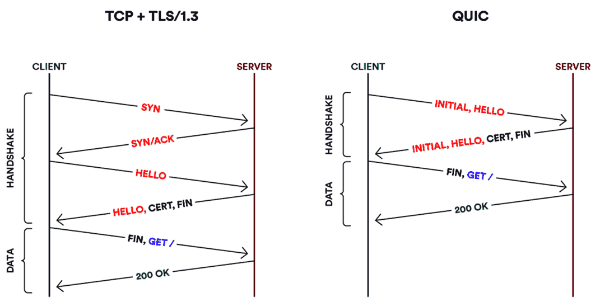

Lab Questions
-------------

Chapter 4 Homework
------------------

Saving Round Trips
------------------

- The layered nature of our stack can cause inefficiency
- TCP requires a handshake to establish a connection
- If we desire encryption, we need a second handshake to establish that

QUIC
----

- Combines establishing a connection and establishing encryption into one handshake
- Can save one RTT of latency when creating connections
- HTTP/3 uses QUIC for transport

---

---

Connection Identifiers in QUIC
------------------------------

- TCP connections are defined by their address and port tuple
- QUIC connections are defined by a 64-bit ID generated by the client
- Using a separate ID greatly simplifies the process of migrating connections from one network to another

5.3 Remote Procedure Call
=========================

Request/Reply
-------------

- Simple paradigm for interacting with a server is to make a request and *block* while waiting for a reply.

---

RPC Challenges
--------------

- IP is unreliable
- Packets may be reordered
- Message may not fit in single packets

RPC Requirements
----------------

1. Reliable communication protocol
2. A mechanism to convert data and instructions to a shared format (stub combiler)

---

RPC Identifiers
---------------

- Provide a name space for uniquely identifying the procedure to be called
- Match each reply message to the corresponding request message

Overcoming Network Limitations
------------------------------

- Reliability (we can use TCP, but it may be more expensive)_
- Support for large message

---

---

Implicit ACK
------------

- In some cases we may be able to skip sending explicit ACKs
- We can use replys and requests as implict ACKs

---

---

