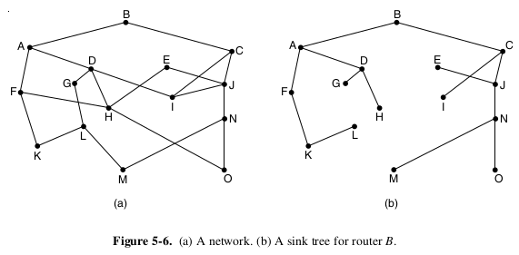
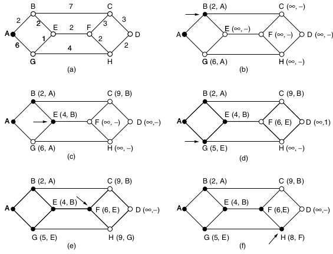

Routing Algorithms
==================

---

Routing algorithms decide which outgoing line incoming data should be transmitted on

Static Routing
--------------

- Non-adaptive
- Routes are determined when the network is booted

Dynamic Routing
---------------

- Adaptive
- Routes are adjusted based on network conditions

Optimality Principle
--------------------

If router J is on the optimal path from I to K, then the optimal path from J to K is on the same route.

---

Directed Acyclic Graph (DAG)
----------------------------

- Graph with no loops
- Edges have directionality

Shortest Path Algorithms
========================

---

- Number of hops
- Edge values

---

---

Routers only have local information, so shortest path calculations may not be possible
