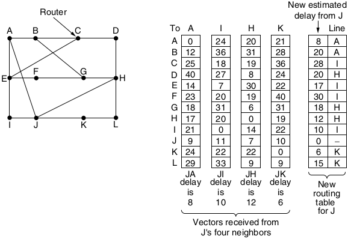
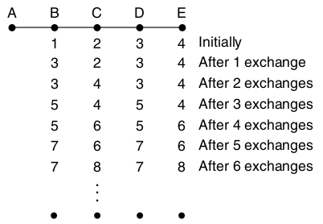
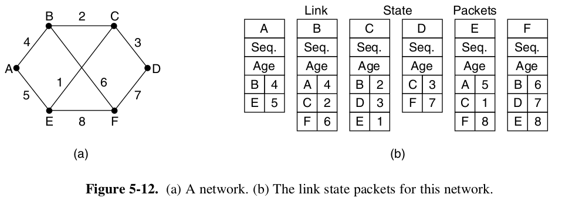
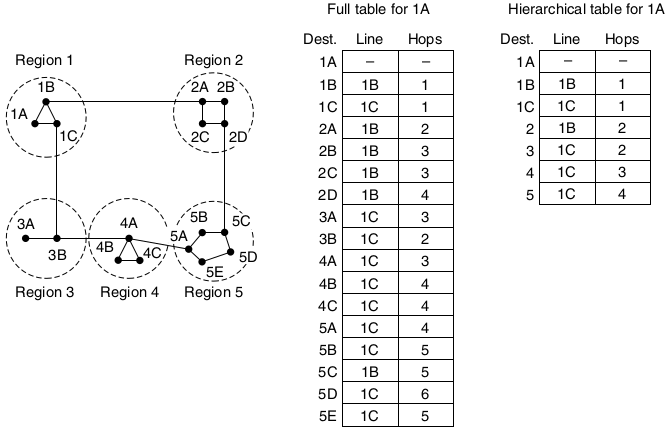
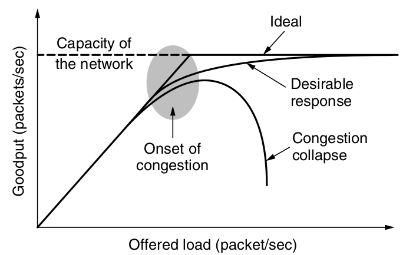
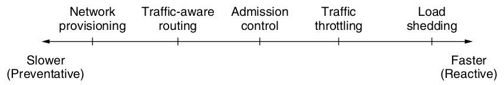
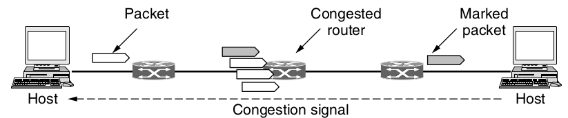
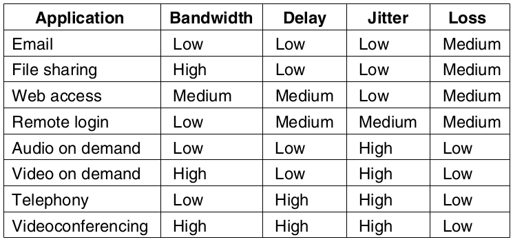

Flooding
========

---

Send every incoming pack out on every other link

Infinite packets
----------------

- Routing loops will cause unlimited packets to be created
- Can be addressed with a hop count or time-to-live (TTL)
- Still produces exponentially many duplicate packets

Flooding Advantages
-------------------

- Simple
- Extremely robust to network issues

Distance Vector Routing (Bellman-Ford)
======================================

---

- Routers maintain a list of the best next hop to arrive at a destination
- Tables are updated by communication between routers

---

---

Link State Routing
==================

---

Replaced Distance Vector Routing in 1979 on ARPANET

---

Process
-------

1. Routers discover neighbors and learn addresses
2. Set cost metric for neighbors
3. Construct a packet containing this knowledge
4. Send the packet to all other routers
5. Compute the shortest path for every other router

---

---

Link state packets are generally distributed via flooding

Hierarchical Routing
====================

---

Routing tables become very large if we try to keep track of the entire global Internet, but we can subdivide the network logically.

---

Congestion Control
==================

---

Too many packets being transmitted over a network causes packet delay and degraded performance.

---

Congestion Control and Flow Control
-----------------------------------

- Flow control deals with traffic between a pair of hosts
- Congestion control deals with the entire network

Congestion Control Tools
------------------------

- Provisioning - Expanding the physical layer
- Traffic-aware routing - Adjust routes to avoid congestion
- Admission control - Refuse new connections
- Traffic throttling - Ask hosts to send more slowly
- Load shedding - Discard packets

---

Traffic Throttling
------------------

- Congestion avoidance - let's hosts know to backoff before critical congestion
- Exponentially weighted moving average (EWMA) could be used as metric
- May send choke packet to senders to explicitly request slowdown
- Packets may be tagged to notify hosts of congestion in Explicit Congestion Notification

---

Load Shedding
-------------

- Last resort
- Simply drop packets
- May drop early using Random Early Detection (RED)

Quality of Service
==================

---

How do we handle services that need stronger guarantees from the networks?

Overprovisioning
----------------

Simply install more hardware than the network needs

QoS considerations
------------------

1. What applications need from the network.
2. How to regulate the traffic that enters the network.
3. How to reserve resources at routers to guarantee performance.
4. Whether the network can safely accept more traffic.

Flow
----

Stream of packets from one destination to another

Flow needs
----------

Needed quality of service determined from:

- Bandwidth
- Delay
- Jitter
- Loss

---

