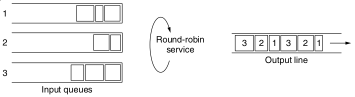
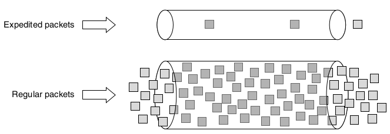
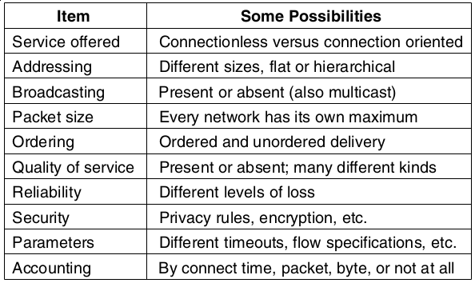
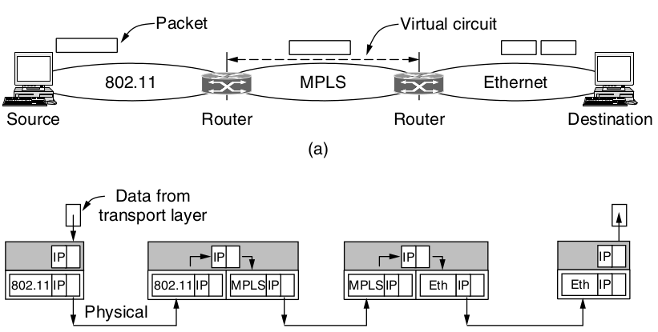

Quality of Service
==================

---

How do we handle services that need stronger guarantees from the networks?

Overprovisioning
----------------

Simply install more hardware than the network needs

QoS considerations
------------------

1. What applications need from the network.
2. How to regulate the traffic that enters the network.
3. How to reserve resources at routers to guarantee performance.
4. Whether the network can safely accept more traffic.

Flow
----

Stream of packets from one destination to another

Flow needs
----------

Needed quality of service determined from:

- Bandwidth
- Delay
- Jitter
- Loss

---

Traffic Shaping
===============

---

Regulating the average flow rate of data as it enters the network

Packet Scheduling
=================

Considerations
--------------

- Bandwidth
- Buffer space
- CPU cycles

Algorithms
----------

First-in, first out (FIFO)
--------------------------

- Simple
- Tail drop - new packets that don't fit in the queue are dropped
- Flows from different hosts can disrupt one another

Fair Queuing
-------------

- Routers have separate queues per flow
- Packets are sent from queues in round-robin fashion

---

Weighted Fair Queuing
----------------------

- Give certain hosts multiple packets per round

Differentiated Services
-----------------------

- We may prefer class-based over flow-based prioritization in some cases
- Expedited forwarding may be used on certain marked packets

---

Internetworking
===============

---

- Many types of networks exist
- We want to connect them

---

---

