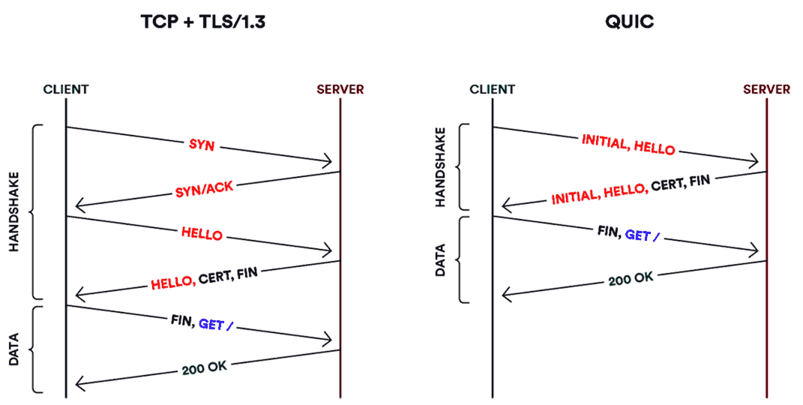

5.2 Reliable Byte Stream (TCP)
==============================

UDP
---

- Provides very simple demultiplexing to processes on a system
- Implemented as a thin wrapper over IP packets

Missing Features in UDP
-----------------------

- Reliability
- In-order delivery
- Congestion control

Sliding Window Protocol
-----------------------

- Discussed at the link layer
- Similar to ARQ
- Allows multiple packets (window) to be in flight at once

Sliding Window in TCP
---------------------

- Requires connection establishment process, as we aren't dealing with a simple pair of devices
- RTT will vary greatly and be unknown initially
- Reordering must be accounted for
- Hosts may support different (and smaller than ideal) window sizes
- Congestion

---


---

{height=540px}

TCP Flags
---------

- SYN - Used for connection establishment
- FIN - Used for connection teardown
- RESET - Used for error handling to reset connection
- ACK - Set to indicate that the Acknowledgement field is valid

---


Establishing a Connection
-------------------------

- Passive open - One party begins listening for connections
- Active open - A second party sends message to initiate a connection
- Messages are exchanged to confirm connection and set parameters

---


---

Should sequence numbers start at zero?

Reuse
-----

- Connections between a pair of hosts may be torn down and remade frequently
- To avoid confusing packets from different incarnations of the same connection, we start each from a new number

---

{height=540px}

Buffering Data
--------------

- The sender needs to buffer data until it has been acknowledged
- The receiver needs to buffer out of order data

---


Flow Control
------------

- Hosts advertise an appropriate max windows size using `AdvertisedWindow` in each segment
- Senders respect this size in order to prevent overflowing a receiver

Sequence number wrapping
------------------------

- We need enough space in our sequence number to prevent reuse
- The original 32-bit number is too small for many modern networks, so also consider the 32-bit timestamp field

Triggering Transmission
-----------------------

How do we decide when to transmit a segment from our buffer?

Silly Window Syndrome
---------------------

- Sending only segments using MSS requires waiting for a full MSS before sending
- If we send segments smaller than MSS, a segment of that size will continue to be used

---


Nagle's Algorithm
-----------------

- If we have available data and a sufficient window to send a full segment, we do so
- If we have no data in flight, we send any data we have immediately
- Otherwise, we wait until no data is in flight or we have a complete segment to send

Sockets
=======

---

Sockets provide a standard interface from the network to our applications

Socket types
------------

- Stream - provides a virtual circuit
- Datagram - delivers individual packets

Socket Implementation
---------------------

- Independent of network type
- Most typically used with TCP/IP and UDP/IP

---


UDP Sockets in Python
---------------------

Create a socket
---------------

```python
sock = socket.socket(family=AF_INET, type=SOCK_DGRAM)
```

Send Data
---------

- Send raw bytes to a port on a particular IP

```python
sock.sendto(b"Hello!", ("127.0.0.1", 2001))
```

Get Data
--------

- Returns bytes from socket when available

```python
data, address = sock.recvfrom(1024)
```

---

Close a socket

```python
sock.close()
```

Bind
----

- Used when implementing a server
- Tells the OS to direct incoming UDP packets to your process

```python
sock.bind(("127.0.0.1", 2001))
```

Math Server Example
-------------------

```python
import socket

sock = socket.socket(socket.AF_INET, socket.SOCK_DGRAM)

sock.bind(("127.0.0.1", 8001))

while True:
    data, address = sock.recvfrom(1024)

    value = int.from_bytes(data, "little")
    square = value ** 2

    sock.sendto(square.to_bytes(4, "little"), address)
```

Math Client
-----------

```python
import socket

sock = socket.socket(socket.AF_INET, socket.SOCK_DGRAM)

operand = int(input("Value to send:"))

sock.sendto(operand.to_bytes(4,'little'), ("localhost", 8001))

data, address = sock.recvfrom(1024)
print(int.from_bytes(data,'little'))
```

QUIC
====

Saving Round Trips
------------------

- The layered nature of our stack can cause inefficiency
- TCP requires a handshake to establish a connection
- If we desire encryption, we need a second handshake to establish that

QUIC
----

- Combines establishing a connection and establishing encryption into one handshake
- Can save one RTT of latency when creating connections
- HTTP/3 uses QUIC for transport

---



---

Connection Identifiers in QUIC
------------------------------

- TCP connections are defined by their address and port tuple
- QUIC connections are defined by a 64-bit ID generated by the client
- Using a separate ID greatly simplifies the process of migrating connections from one network to another

5.3 Remote Procedure Call
=========================

Request/Reply
-------------

- A Simple paradigm for interacting with a server is to make a request and *block* while waiting for a reply.

---


RPC Challenges
--------------

- IP is unreliable
- Packets may be reordered
- Message may not fit in single packets

RPC Requirements
----------------

1. Reliable communication protocol
2. A mechanism to convert data and instructions to a shared format (stub compiler)

---

{height=540px}

RPC Identifiers
---------------

- Provide a name space for uniquely identifying the procedure to be called
- Match each reply message to the corresponding request message

Overcoming Network Limitations
------------------------------

- Reliability (we can use TCP, but it may be more expensive)
- Support for large messages

---


---

Implicit ACK
------------

- In some cases we may be able to skip sending explicit ACKs
- We can use replys and requests as implicit ACKs

---


---


---


5.4 Transport for Real-Time
===========================

Real-time
---------

- Traditional uses of network (email, file transfers, etc) don't have real-time requirements
- Some more modern uses (VoIP, videoconferencing, etc) do have these requirements

Application Types
-----------------

- Interactive - two or more people communicating directly (Google Meet, VoIP)
- Streaming - data is being delivered and viewed immediately (Netflix, YouTube)

UDP
---

- Adds no additional latency
- Does not provide reliability
- Does not handle reordering

TCP
---


- Reliable
- Handles reordering
- Adds latency in case of errors or reordering
RTP
---

- Real-time protocol
- Designed to handle communication between a variety of interactive applications

---


Requirements
------------

- Coding scheme advertisement and selection
- Timestamping for continuous playback from buffer
- Stream sync
- Packet loss indication
- Usernames
- Limited overhead

Ports
-----

- Data is sent over an even-numbered UDP port
- Control information is sent over a port one higher

Handshaking
-----------

- Video protocol
- Voice protocol

---


Header Fields
-------------

- V - version
- P - padding
- x - counts contributing sources
- m - marker bit (application specific use)
- pt - payload type to demultiplex streams

Timestamps
----------

- Indicate start time of first sample in packet
- Does not represent actual time, only relative time
- Time unit is left up to application

Synchronization Source
----------------------

- SSRC
- 32-bit self-assigned address
- Creates separation from IP protocol
- Allows multiple streams (e.g. cameras) from 1 IP address

Contributing Sources
--------------------

- A mixer may combine multiple streams into a single stream
- The SSRC values for the contributing sources will be listed by a mixer in the CSRC fields

Congestion Control
------------------

- TCP is not used for latency reasons
- We can't send data slower
- We can change parameters to send less data

Security
--------

- Unencrypted by default
- DTLS and SRTP can provide encryption

Control Protocol
----------------

- Feedback on the performance of the application and the network
- A way to correlate and synchronize different media streams that have come from the same sender
- A way to convey the identity of a sender for display on a user interface


Time Synchronization
-------------------

- RTCP packets include a mechanism to relate stream-specific timing information to clock time

6.1 Issues in Resource Allocation
=================================

Resource Allocation
-------------------

- Process by which network elements try to meet the competing demands that applications have for network resources
    - Link bandwidth
    - Router/switch buffer space

Congestion Control
------------------

- Efforts made by network nodes to prevent or respond to overload conditions
- Congestion is bad for everyone
- The goal should be to eliminate or even prevent it

Flow Control
------------

- Congestion control deals with the network as a whole
- Flow control deals with a pair of hosts not overwhelming one another

Packet-Switched Network
-----------------------

- Multiple links connected to deliver packets
- Hosts and routers do not have complete information about available bandwidth of the network

---


Connectionless Flows
--------------------

- IP packets are routed independently
- It is useful to consider packets between a pair of hosts following a similar route as a single *flow*

---


Soft State
----------

- State that does not need to be explicitly created and destroyed via signaling
- Most routers maintain soft state about flows to aid in resource allocation

Characteristics
---------------

- Router-Centric versus Host-Centric
- Reservation-Based versus Feedback-Based
- Window Based versus Rate Based

Evaluation
----------

- Throughput should be maximized
- Delay should be minimized

Power
-----

- Throughput / Delay
- Ratio is a function of load placed on network by allocation mechanism
- Ratio should be maximized

---


Fairness
--------

- It isn't sufficient to optimize overall throughput and delay
- Applications and hosts competing for network resources must be given appropriate usage


6.2 Queuing Disciplines
=======================

Routers
-------

- Maintain queues of packets to be forwarded
- The design and use of these queues is a queuing discipline

FIFO
----

- First-in, first-out
- Packets are forwarded in the order they arrive

---

{height=540px}

Fairness
--------

- FIFO allocates packets based on arrival
- A host sending a lot of data will dominate the link
- Hosts sending little data will experience high latency

Fair Queuing
-------------

- Use buffers for each flow
- Send packets in FIFO order per flow in round-robin fashion

---


Packet Sizes
------------

- Packets may be different sizes
- We must account for this in order to ensure fairness
- This makes the simple round-robin example a bit more complicated

---


Properties
----------

1. *Work conserving* - The link will be active as long as there is a packet in the queue
2. Flows may use only 1/n of the link bandwidth when the link is full

Weighted Fair Queuing
---------------------

- We can assign weights to flows to give them more or less bandwidth
- Weights can be determined in various ways (hosts, traffic type, etc)
- Weights can ultimately be used to shape traffic and provide differing quality of service
