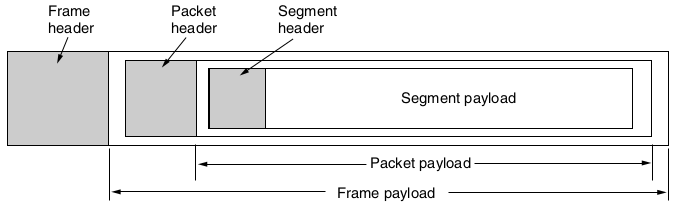
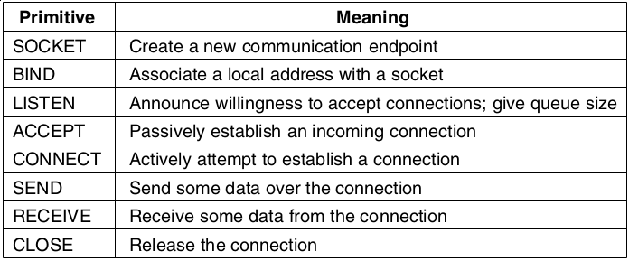
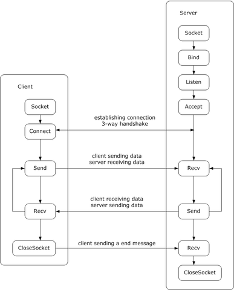

Transport Layer
===============

---

> The transport layer builds on the network layer to provide data transport from a process on a source machine to a process on a destination machine with a desired level of reliability that is independent of the physical networks currently in use.

Layers
------

- Application
- Transport <-- We are here
- Network
- Link
- Physical

Transport Entity
----------------

Software and hardware in the transport layer that provides efficient and reliable data transmission to processes at the application layer.

---


Types of Service
----------------

- Connection oriented
- Connectionless

Why do we need the transport layer?
-----------------------------------

- Doesn't the network layer already provide many of these services?
- Couldn't it be amended to include the missing services?

Transport Layer Implementation
------------------------------

- Transport layer is implemented in hosts
- Network layer is implemented in routers
- The transport layer provides an API for programs in our system to access the network in well-defined way

A programmer's view layers
--------------------------

- Transport Service User
  - Application Layer
- Transport Service Provider
  - Transport, Network, Link, and Physical Layers

---



Berkeley Sockets
================

---



---



Python Echo Example
--------------

---

```python
# Echo server
import socket

with socket.socket(socket.AF_INET, socket.SOCK_STREAM) as s:
    s.bind(('0.0.0.0', 2000))
    s.listen()
    conn, addr = s.accept()
    with conn:
        print('Connected by', addr)
        while True:
            data = conn.recv(1024)
            if not data: break
            conn.sendall(data)
```

---

```python
# Echo client
import socket

with socket.socket(socket.AF_INET, socket.SOCK_STREAM) as s:
    s.connect(('127.0.0.1', 2000))
    s.sendall(b'Hello, world')
    data = s.recv(1024)
print('Received', repr(data))
```

Python Chat Example
-------------------

