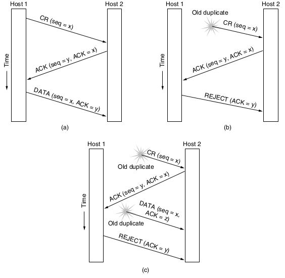
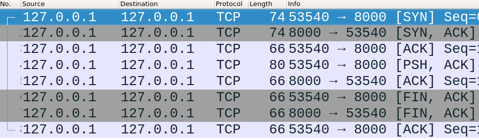

Elements of the Transport Layer
===============================

Addressing
----------

Processes on hosts want to communicate, so we need a way to identify them. These process identifiers are called **ports** at the transport layer.

Establishing Connections
------------------------

- Networks may drop packets
- Networks may duplicate packets

Simple Request + Accept Model
-----------------------------

- Doesn't handle delayed duplicates

Sequence Numbers
----------------

- We can add identifiers to packets to ensure that they are not dupes of current or old connections.
- Unfortunately, this requires hosts to keep track of history.

Limiting Packet Lifetime
------------------------

- Restricted networks
- Hop counts
- Timestamps

Internet Packet Lifetime
------------------------

- Assumed to be 120 seconds
- With this as a given, we can create a correct connection algorithm

TCP Sequence Numbers
--------------------

- Can't be reused for *T* seconds where T is max packet lifetime 

---

---

TCP Handshake Flags
-------------------

- SYN - Syncronize sequence numbers (only set in first packet from each host)
- ACK - Indicates an acknowledgement of data (All packets except the first will have this set)

Netcat
------

- Simply utility to connect Unix pipes to network sockets
- Listen on port 8000: `nc -l 8000`
- Connect to port 8000 on localhost: `nc localhost 8000`

NCat
----

- Similar to netcat, but with TLS support
- Connect to a HTTPS endpoint: `ncat --ssl host 443`

---

