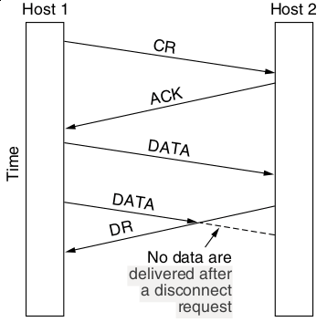
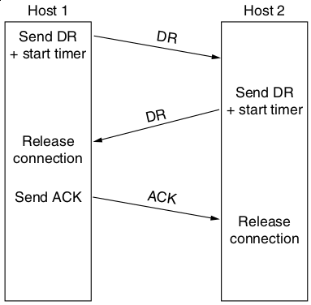
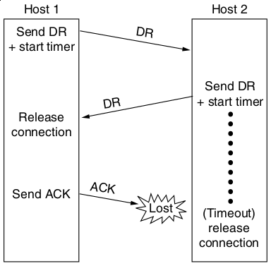

Elements of the Transport Layer
===============================

Addressing
----------

Processes on hosts want to communicate, so we need a way to identify them. These process identifiers are called **ports** at the transport layer.

Establishing Connections
------------------------

- Networks may drop packets
- Networks may duplicate packets
- Networks can duplicate packets

Simple Request + Accept Model
-----------------------------

- Doesn't handle delayed duplicates

Sequence Numbers
----------------

- We can add identifiers to packets to ensure that they are not dupes of current or old connections.
- Unfortunately, this requires hosts to keep track of history.

Limiting Packet Lifetime
------------------------

- Restricted networks
- Hop counts
- Timestamps

Internet Packet Lifetime
------------------------

- Assumed to be 120 seconds
- With this as a given, we can create a correct connection algorithm

TCP Sequence Numbers
--------------------

- Can't be reused for *T* seconds where T is max packet lifetime 

---

---

TCP Handshake Flags
-------------------

- SYN - Syncronize sequence numbers (only set in first packet from each host)
- ACK - Indicates an acknowledgement of data (All packets except the first will have this set)

Netcat
------

- Simply utility to connect Unix pipes to network sockets
- Listen on port 8000: `nc -l 8000`
- Connect to port 8000 on localhost: `nc localhost 8000`

NCat
----

- Similar to netcat, but with TLS support
- Connect to a HTTPS endpoint: `ncat --ssl host 443`

---

Connection Release
------------------

- Asymmetric release - One party may terminate the connection
- Symmetric release - Connections are broken into unidirectional pipes and each host must be terminated

---

---

---

Solution
--------

- We can't solve this problem over unreliable links
- We use symmetric release to allow each side to determine when it is finished

---

---

TCP Connection Release Flags
----------------------------

- FIN - Symmetric close
- RST - Asymmetric close - may be used by certain servers that understand data flow patterns (e.g. HTTP)

Error Control
-------------

- Frames carry CRC checks
- Sequence number manage loss via Automatic Repeat Request
- Sliding window is used to minimize outstanding frames

Duplication of Purpose with Lower Layers
----------------------------------------

The transport layer ensures that we get a reliable end-to-end connection

Congestion Control
------------------

- If we send too many packets on the network, we see a lower quality of service

---

Power
-----

- Load over Delay
- Used to identify appropriate values for offered load

Regulating Send Rate
--------------------

How do we control how much data hosts may send?

---

---

How do we decide on an approprate flow rate?

---

