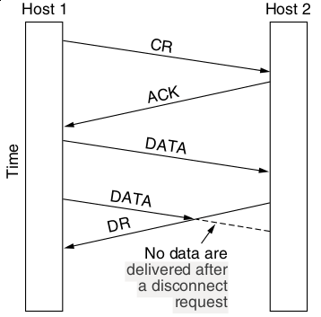
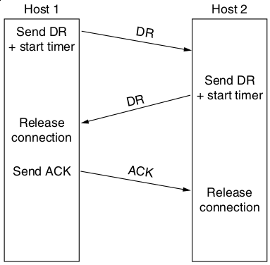
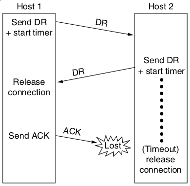
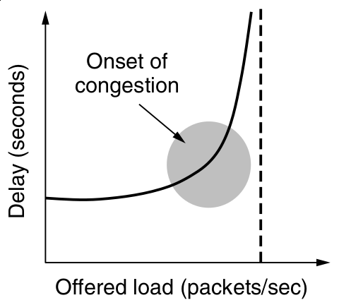
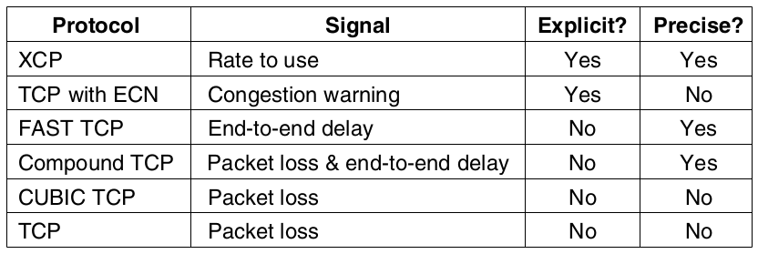
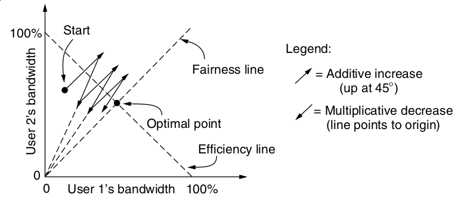

Elements of the Transport Layer
===============================

Connection Release
------------------

- Asymmetric release - One party may terminate the connection
- Symmetric release - Connections are broken into unidirectional pipes and each host must be terminated

---

---

---

Solution
--------

- We can't solve this problem over unreliable links
- We use symmetric release to allow each side to determine when it is finished

---

---

TCP Connection Release Flags
----------------------------

- FIN - Symmetric close
- RST - Asymmetric close - may be used by certain servers that understand data flow patterns (e.g. HTTP)

Error Control
-------------

- Frames carry CRC checks
- Sequence number manage loss via Automatic Repeat Request
- Sliding window is used to minimize outstanding frames

Duplication of Purpose with Lower Layers
----------------------------------------

The transport layer ensures that we get a reliable end-to-end connection

Congestion Control
------------------

- If we send too many packets on the network, we see a lower quality of service

---

Power
-----

- Load over Delay
- Used to identify appropriate values for offered load

Regulating Send Rate
--------------------

How do we control how much data hosts may send?

---

---

How do we decide on an approprate flow rate?

---

Transmission Control Protocol (TCP)
===================================

Sockets
-------

- Service is obtained by creating end points called sockets
- Sockets are identified by an IP address and port combination
- Addresses can be IPv4 or IPv6
- Ports are 16 bit identifiers

Common Ports
------------

- 22 SSH
- 25 SMTP
- 53 DNS
- 80 HTTP
- 143 IMAP
- 443 HTTPS

NMAP Example
------------

TCP Connections
---------------

- Always point-to-point
- Always full duplex

UDP
===
