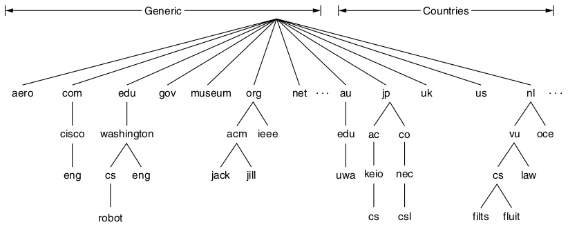

Application Layer
=================

---

The application layer makes use of transport systems to create networked software programs.

Layers
------

- Application <-- We are here
- Transport
- Network
- Link
- Physical

Domain Name System (DNS)
========================

Names
-----

- We can use IP addresses for contacting services
- IP addresses may change as hosts change network providers
- IP addresses are not memorable
- We'd prefer a nicer system

Hosts files
-----------

- Initially, we simply used a configuration file to map hosts to IP addresses
- This file can still be found on modern systems
- e.g. `C:\Windows\System32\drivers\etc` or `/etc/hosts`

Host-based Ad Blocking
----------------------

- Create a hosts file that maps known ad servers to your local system
- Requests to these hosts are now unable to be completed
- Example: [AdAway Hosts File](https://adaway.org/hosts.txt)

Limitations of Host Files
-------------------------

- Hard to manage and update
- Large local file size

DNS
---

- Manages mapping address to hostnam=e over the entire network
- Servers and responses are arranged hierarchically

Top-level domains
-----------------

- Managed by Internet Corporation for Assign Names and Numbers (ICANN)
- May be generic or country domains

---

---

Registrars
----------

- Appointed by ICANN to manage second-level domains for a TLD

Resource Records (RR)
---------------------

- We can query more than addresses from DNS

Name Resolution
---------------

- Process of converting name to address
- Software typically calls into the local resolver
- Responses may be cached or authoritative
- Authoritative results came from the authority that manages the record

Record Caching
--------------

- All records return a time-to-live indicating how stable they are
- Records may be cached by servers until this TTL expires

Email
=====

Encryption
==========

Transport Layer Security
------------------------

- Provides an encrypted connection much like a TCP socket
- Keys are created during handshake
- Identity of server is verify using public key cryptography (certificate)

QUIC and HTTP/3
---------------

- TLS and TCP both require handshakes
- These can be combined to reduce latency
- QUIC was proposed in 2012 to address this and has now been adopted as part of HTTP/3

---

---

---

QUIC Performance
----------------

- Can improve latency by 10-30%

