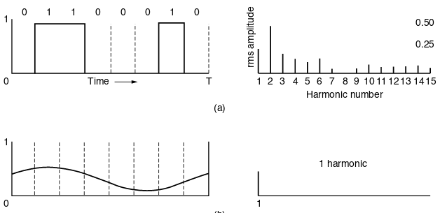
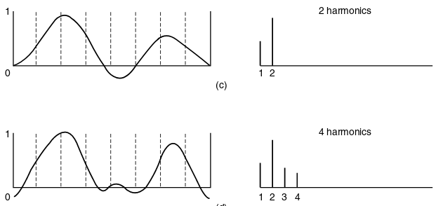

Chapter 1 Homework Posted
=========================

Physical Layer
==============

---

- Defines low-level (electrical, RF, timing, etc) interfaces which allow bits to be sent over channels

Layers
------

- Application
- Transport
- Network
- Link
- Physical <-- We are here

Theory
======

Fourier Analysis
----------------

Periodic functions can be represented as an infinite series of sines and cosines.

---

$$g(t) = {1 \over 2}c + \sum_{n=1}^{\infty}{a_n \sin(2\pi n f t)} + \sum_{n=1}^{\infty}{b_n \cos(2\pi n f t)}$$

---

---

---

---

---

JPEG Example
------------

Bandwidth Limited Signals
-------------------------

Why does this matter?

---

---

---

---

---

Transmission degradation
------------------------

- All media cause some signal attenuation
- In most media, higher frequencies are attenuated more than lower frequencies

---

Bandwidth (Analog)
------------------

The width of frequency range transmitted without being strongly attenuated

Bandwidth (Digital)
-------------------

Maximum data rate of a channel (bits/second)

Baseband signals
----------------

- Frequency starts from 0

Passband signals
----------------

- Frequency does not start at zero
- For example, 802.11g specifies channels at ~2.4GHz + 20MHz

Voice-grade line
----------------

- Implments a low pass filter at around 3KHz limiting the analog bandwidth

---

---

---

Binary signals hit hard frequency limits related to analog bandwidth

Maximum bandwidth of a channel
------------------------------

Nyquist
-------

"Perfect" channel data rate

$$\textrm{max data rate} = 2 B \log_2{V} \textrm{ bits/sec}$$

Signal to Noise Ratio
---------------------

- Most channels include noise (RF interference, crosstalk, etc)
- The amount of noise is measured as a the ratio of signal power to noise power
- Measured in decibels as:

$$ \textrm{dB} = 10 log_{10}{S \over N} $$

Shannon
-------

Noisy channel data rate

$$\textrm{max data rate} = B \log_2(1 + {S \over N}) \textrm{ bits/sec}$$

Kotelnikov
----------

- Discovered the sampling theorem prior to Shannon

Guided Transmission Media
=========================

---

- Unguided Media - Wireless, Satellite links, etc
- Guided Media - Copper, Fiber, etc

---

Storage Media
-------------

In some cases it may be most cost and time effective to ship physical media.

[AWS Snowmobile](https://aws.amazon.com/snowmobile/)

Effective Bandwidth
-------------------

- 8TB disk driven to Indianapolis in an hour

---

$$ {8 TB \over H} { 1 H \over 3600 s } { 8000 Gb \over TB } = 17.7  {Gb \over s} $$

Twisted Pair
------------

- Twisting limits radiated signal
- Differential signaling avoid external interference

Applications
------------

- Phone line
- Local networks

Types
-----

- Category 3 - Older LANs
- Category 5 - Common LANs, more twists for higher data rate
- Category 6 - Required for Gigabit
- Category 7 - Required for higher speeds, includes shielding